# Commonwealth Monorepo Architecture

## 1. Overview

The Commonwealth monorepo is a modular, event-driven platform for decentralized governance, social, and blockchain-based applications. It leverages a CQRS (Command Query Responsibility Segregation) pattern, a rich domain model, and a robust infrastructure stack to support scalable, extensible, and secure community features.

---

## 2. System Components

### 2.1 Packages

- **commonwealth**: Main application (API server, client, scripts, deployment logic)
- **farcaster-app**: Farcaster protocol integration
- **snapshot-listener**: Listens to and processes Snapshot events
- **load-testing**: Load and performance testing utilities
- **external-api-testing**: Utilities for testing external APIs

### 2.2 Libraries

- **model**: Domain logic, aggregates, policies, services, and DB models
- **core**: Framework utilities, CQRS, types, error handling
- **adapters**: Protocol adapters (trpc, express, rabbitmq, etc)
- **schemas**: Zod schemas for API and DB validation
- **shared**: Shared utilities, constants, and types
- **evm-protocols**: EVM-compatible blockchain integrations
- **chains**: Chain adapters for various protocols
- **railway, sitemaps, eslint-plugin**: Miscellaneous utilities and plugins

### 2.3 Workers/Jobs

- **graphileWorker**: Background job processing
- **knock**: Notification and messaging jobs
- **twitterWorker**: Twitter event processing
- **evmChainEvents**: EVM chain event listeners
- **commonwealthConsumer**: Consumes and processes RabbitMQ messages
- **messageRelayer**: Relays messages between services
- **discordBot**: Discord bot integration

---

## 3. Application Flow

### 3.1 Client-Server Interaction

- React web client communicates with the API server via HTTP and WebSocket.

### 3.2 API Layer

- Node.js/Express server exposes REST, TRPC, and WebSocket endpoints.

### 3.3 Domain Logic

- Implemented in the `model` lib using CQRS, aggregates, policies, and services.

### 3.4 Adapters

- Protocol adapters connect core logic to external systems (RabbitMQ, Express, TRPC, etc).

---

## 4. Infrastructure

### 4.1 Databases

- PostgreSQL for persistent storage. See [Database-ERD.md](common_knowledge/Database-ERD.md) for schema.

### 4.2 Caching

- Redis for caching, rate limiting, and ephemeral data.

### 4.3 Messaging

- RabbitMQ for event-driven communication and decoupling.

### 4.4 Containers & Orchestration

- Docker Compose orchestrates all containers and services for local and production environments.

---

## 5. Initialization & Configuration

### 5.1 Environment Variables

- Managed via `.env` files and documented in [Environment-Variables.md](common_knowledge/Environment-Variables.md).

### 5.2 App Initialization Flow

- See [App-Initialization-Flow.md](common_knowledge/App-Initialization-Flow.md) for details on bootstrapping and dependency wiring.

---

## 6. Event-Driven Architecture

### 6.1 RabbitMQ Usage

- Used for asynchronous, event-driven communication between services and workers.

### 6.2 Outbox Pattern

- Ensures reliable event delivery and recovery from failures.

### 6.3 Idempotency & Retry Strategies

- Policies for handling duplicate or failed events. See [RabbitMQ.md](common_knowledge/RabbitMQ.md).

---

## 7. Security & Permissions

### 7.1 Authentication

- OAuth, wallet, and session management.

### 7.2 Authorization

- Tiered access, roles, and middleware.

### 7.3 Secrets Management

- Secure handling of sensitive configuration.

---

## 8. Deployment & Operations

### 8.1 CI/CD

- Build, test, and deployment pipelines.

### 8.2 Monitoring & Logging

- Datadog, Rollbar, and health checks.

### 8.3 Scaling & Fault Tolerance

- Strategies for handling load and failures.

---

## 9. Extensibility & Customization

### 9.1 Adding and Running Jobs/Workers

- **Jobs** such as `graphileWorker`, `knock`, `twitterWorker`, `evmChainEvents`, `commonwealthConsumer`, `messageRelayer`, and `discordBot` are located in `packages/commonwealth/server/workers/`.
- In production, these are typically run as separate processes or containers.
- **DEV_MODULITH**: In development mode, you can set the `DEV_MODULITH` environment variable to `true` to run all jobs/workers in the same server process as the API. This simplifies local development and debugging. Example:

  ```sh
  DEV_MODULITH=true pnpm run start
  ```

- This will start the API server and all background jobs in a single process, reducing the need for multiple terminals or containers.

### 9.2 Adding New Domain Logic

- **Aggregates**: Create a new folder under `libs/model/src/aggregates/` for your domain entity. Implement commands, queries, and event handlers as needed.
- **Commands**: Add a `*.command.ts` file exporting a factory function that returns a `Command<Schema>`. Use Zod schemas for input/output validation.
- **Queries**: Add a `*.query.ts` file for read operations, following the same pattern as commands.
- **Policies**: If your logic is event-driven or cross-cutting, add a new policy in `libs/model/src/policies/` or extend an existing one. Policies listen to events and can trigger commands or side effects.
- **Export** your new logic in the relevant `index.ts` files for automatic discovery and registration.
- **Testing**: Add tests in `libs/model/test/` to cover your new logic.
- **Documentation**: Update or add documentation in `common_knowledge/` as needed.

---

## 10. Diagrams

### 10.1 Logical Architecture Diagram

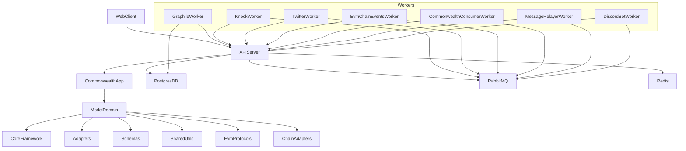

### 10.2 Physical/Deployment (Components) Diagram

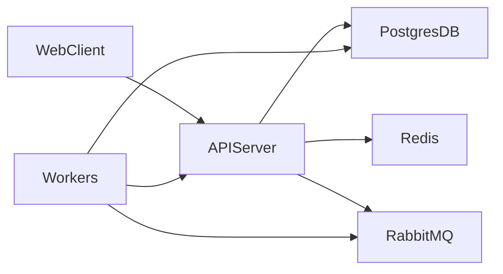

### 10.3 C4 Context Diagram

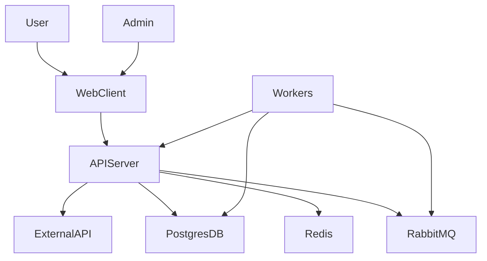

### 10.4 C4 Container Diagram

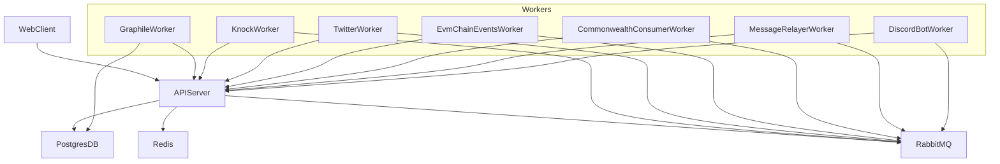

### 10.5 C4 Component Diagram (API Server)

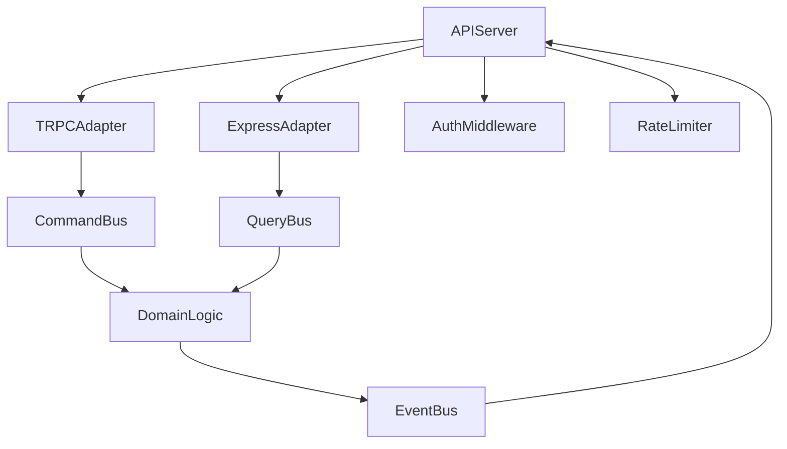

### 10.6 C4 Component Diagram (WebClient)

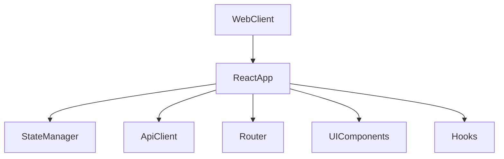

### 10.7 C4 Component Diagram (Worker)

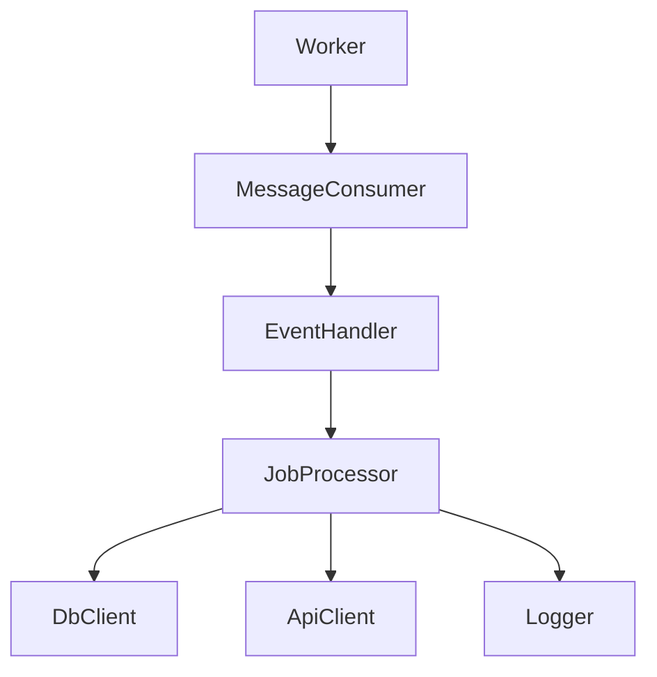

### 10.8 C4 Component Diagram (GraphileWorker)

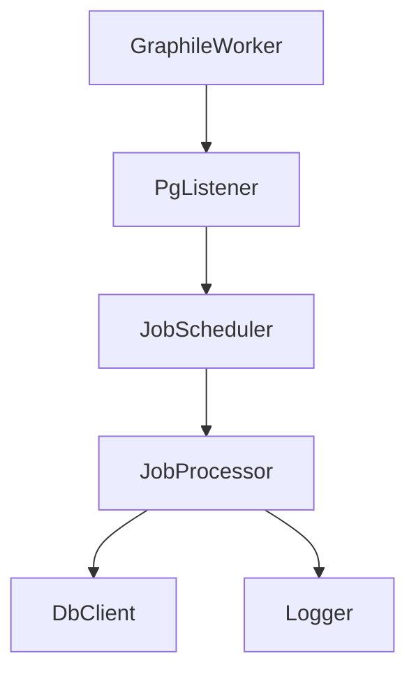

### 10.9 C4 Component Diagram (KnockWorker)

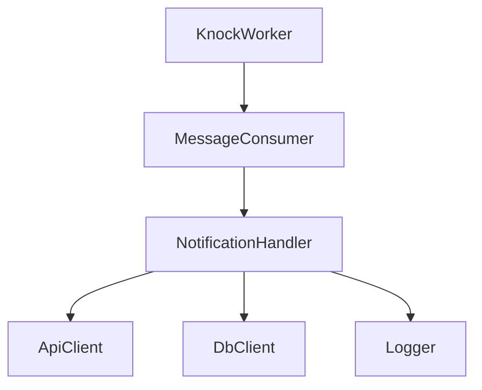

### 10.10 C4 Component Diagram (TwitterWorker)

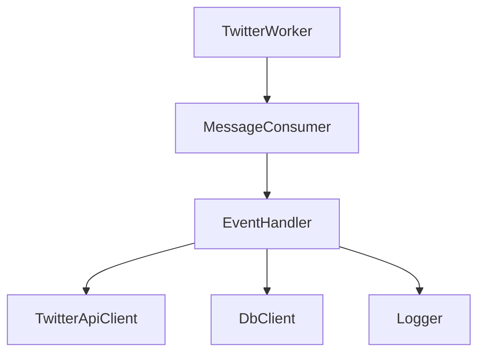

### 10.11 C4 Component Diagram (EvmChainEventsWorker)

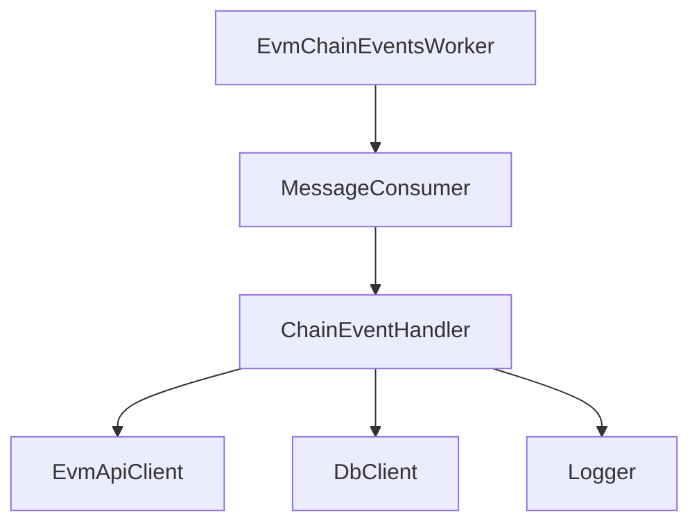

### 10.12 C4 Component Diagram (CommonwealthConsumerWorker)

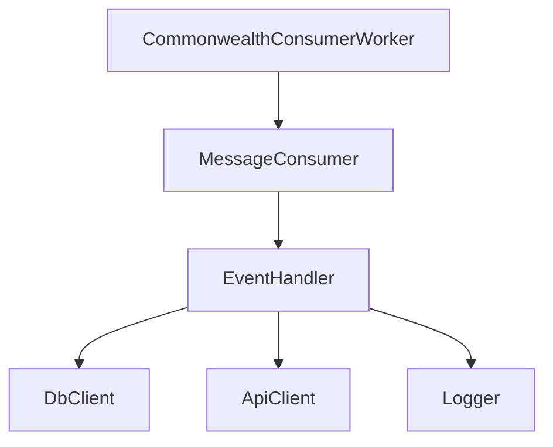

### 10.13 C4 Component Diagram (MessageRelayerWorker)

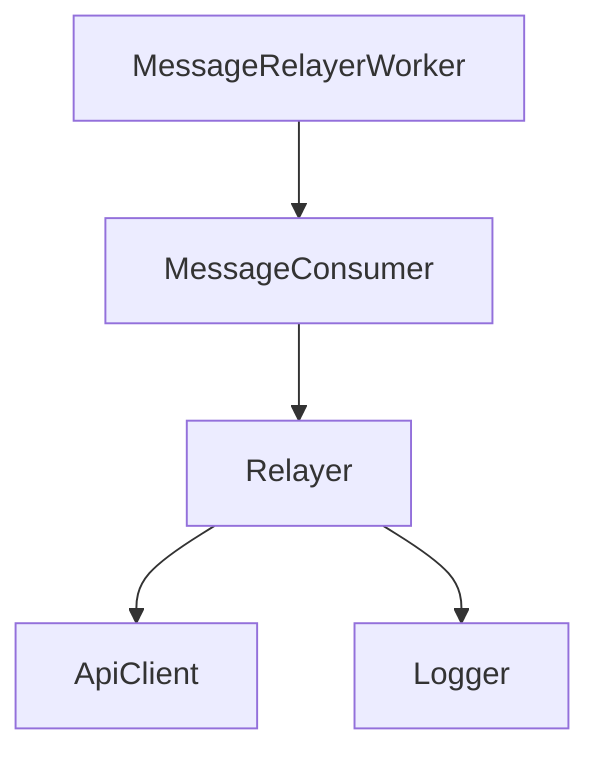

### 10.14 C4 Component Diagram (DiscordBotWorker)


### 10.5 Database ERD

- See [Database-ERD.md](common_knowledge/Database-ERD.md)

---

## 11. Glossary

- (Define key terms, acronyms, and concepts)

## 12. References

- [App-Initialization-Flow.md](common_knowledge/App-Initialization-Flow.md)
- [RabbitMQ.md](common_knowledge/RabbitMQ.md)
- [Environment-Variables.md](common_knowledge/Environment-Variables.md)
- [Database-ERD.md](common_knowledge/Database-ERD.md)
- [Deployment.md](common_knowledge/Deployment.md)
- [State-Management.md](common_knowledge/State-Management.md)
