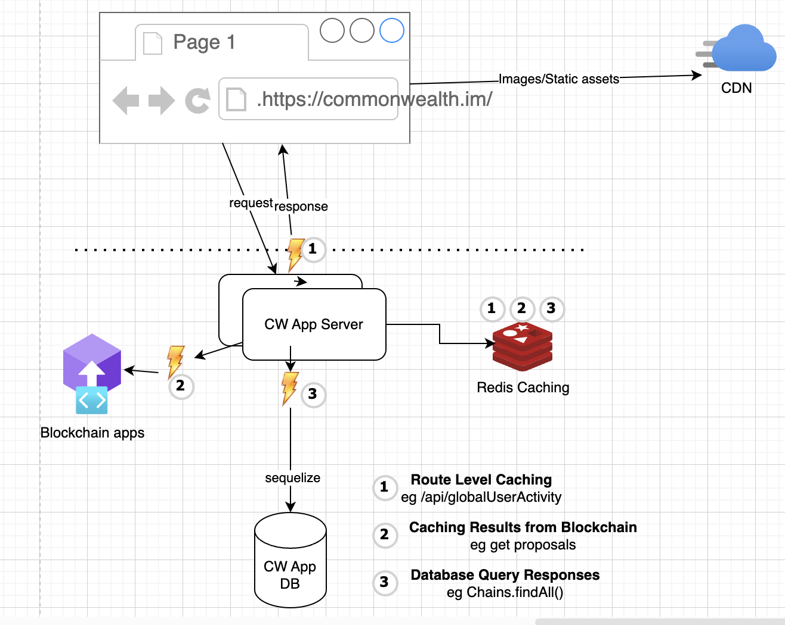

# Caching

## Contents

- [Cache Opportunities](#cache-opportunities)
- [Caching Consideration](#caching-consideration)
  + [Route Level](#route-level)
  + [Blockchain Queries](#blockchain-queries)
  + [Database Queries](#database-queries)
- [Cache Strategies](#cache-strategies)
- [Cache Invalidation Techniques](#cache-invalidation-techniques)
- [Usage](#usage)
  + [Config](#config)
  + [Route Level Caching Example Usage](#route-level-caching-example-usage)
  + [Wrap Functions for caching](#wrap-functions-for-caching)
  + [Background Task Runner - Pre-fetching/ Refreshing result periodically](#background-task-runner---pre-fetching-refreshing-result-periodically)
  + [Activity - Decorator Helper class](#activity---decorator-helper-class)
- [Change Log](#change-log)



## Cache Opportunities

- **App Route Level responses** eg. query responses to user queries /api/viewGlobalActivity
- **Blockchain Query Responses** - Snapshots/Linked Proposals etc
- **Database Query Responses**

## Caching Consideration

[Amazon General Redis Caching Doc](https://docs.aws.amazon.com/whitepapers/latest/database-caching-strategies-using-redis)

- Caching in general can provide performance improvements but does not guarantee correctness.
As famous saying goes:
_"There are only two hard things in Computer Science: cache invalidation and naming things."_

- Reading "Stale Data" from cache - can create many hard to find bugs and potential bad persistent data

### Route Level

- Choosing a right TTL could be very important, as app data is highly transactional

- **Caching Namespace:**
  - Global - eg. /api/viewGlobalActivity
  - User Specific - eg. /api/viewUserActivity or /api/status

- **Hybrid Request Handler** -> Fetch followed by tracking of user activity
  eg. get chain data & record current chain selected by user  - these kind of request handler can only utilize sequelize result caching

```js
const chain = await models.Chain.findOne({ where: { id: req.body.chain } });
req.user.setSelectedChain(chain);
await req.user.save();
```

- **Hybrid Data - Generic Data + User specific data**
  - Breakdown hybrid data endpoints eg. `/api/status` is one of most frequently called endpoint
  - `/api/status` contains both large amount of generic data + small amount of user related data eg. its contains subscriptions data, user can join new community and if cache response using random TTL, we will keep showing him 0 communities joined
  - Potential refactoring - Breakdown request to two endpoints
    - /api/status -> to contain only generic app data - which can be cached more effectively at route level
    - /api/user/status -> to contain only user specific data - which can be query

- **Don't break permission model** eg. don't serve cached response to non-logged in user if endpoint needs to be protected for logged in user only

```js
if (!req.user) {
  return next(new AppError(Errors.NotLoggedIn));
}
```

- Don't cache error responses eg. 5XX, 4XX.
  One good practice to follow for request handler, don't send 200 responses while conveying error message to user.
  Add status==200 or status 2XX check before caching a response

### Blockchain Queries

- These are on-chain requests made via blockchain SDK(s)
  eg. Cosmos SDK - it exposes two endpoints tendermint(rpc) & lcd endpoints against main cosmos chain
- **Immutable Past data** - once queried response can be cached or even persisted for long term
- **Rate Limit** - if we query these blockchain endpoints frequently our app will get throttled and eventually rate limited
- **Slow Response** - some of these endpoints are potentially very slow

### Database Queries

- **Sequelize ORM**
  - Sequelize query & hydrate model objects. It creates new instance of models per new request from app.
  - Hydrated models are then used in business logic processing & appropriate response is returned to user
- **Frequent Find All queries** to less frequently changed data eg. we have 1.5-2K chains
These query might be faster but are fetching large amount of data every time we make query can potentially be cached

```js
models.Chain.findAll({
  where: { active: true },
  include: [
    {
      model: models.Topic,
      as: 'topics',
    },
    {
      model: models.ChainNode,
      required: true,
    },
  ],
})
```

## Cache Strategies

<https://docs.aws.amazon.com/whitepapers/latest/database-caching-strategies-using-redis/caching-patterns.html>

- **Cache-Aside** (Lazy Loading).
  - Read cache if data hit else miss
- **Write-Through**.
  - on updates updates cache too

## Cache Invalidation Techniques

- **TTL based** - can be error prone
- **Write-through** - invalidate related entries on updates to underlying data

## Usage

### Config

It is enabled by default, `DISABLE_CACHE=TRUE` in while deploying your app will disable caching middleware

### Route Level Caching Example Usage

**TTL**

- Duration specify in seconds
- return duration as null to skip caching for particular request
- return duration as 0 to cache forever

**Key**

- default key for any path is `req.originalUrl`
- return key as null to skip caching for particular request

**Namespace: Scope of caching**.

- Key Names follow pattern <GLOBAL_NAMESPACE>[<USER_NAMESPACE>]route_path_or_someotheridentifier
  - Global
     Example All keys for Routes starts with `ROUTE_RESPONSE`, if response is global and same for all users eg `ROUTE_RESPONSE_/viewGlobalActivity`
  - User Level
     If query response is user specific consider adding user specific info to key example `ROUTE_RESPONSE:User<req.user.id>` eg. `ROUTE_RESPONSE:User1279_viewUserActivity`
  
**Key Generator Functions**.  
There three utility functions available as sample, feel free to add your own custom function

- defaultKeyGenerator
  - Good for global routes eg. `/viewGlobalActivity`
  - It return `${req.originalUrl}` as key and get combined with namespace to generate full key

- defaultUserKeyGenerator
  - User specific response consider this as your key generator function eg `/viewUserActitivity`
  - If user is logged in auth middleware will attach user to req object.
     It checks for `req.user` object if it finds that it returns `user:${user.id}_${req.originalUrl}`

- lookupKeyDurationInReq
  - You may require `req.body` or `req.params` to generate dynamic Key & Duration based on request object
  - Add your own middleware to generate custom key and duration and attach it to request object
  - This function will look for `req.cacheKey` & `req.cacheDuration` properties attach to request object by previous middleware, if either is null, will skip caching response of that particular request
  
**Basic Usage**
Add caching as middleware while setting up your route handler
Here is `cacheDecorator.cacheMiddleware(3)`, it will cache values for 3 seconds

```js
app.get(CACHE_ENDPOINTS.JSON, cacheDecorator.cacheMiddleware(3), async (req, res) => {
  log.info(`${CACHE_ENDPOINTS.JSON} called`);
  res.json({ 'message': 'cachedummy response' });
});
```

**Customize key & duration**
Example customize key & duration based on route body or param

- Use `lookupKeyDurationInReq` as key generator
- Attach `cacheKey` & `cacheDuration` to request object

```js
app.post(CACHE_ENDPOINTS.CUSTOM_KEY_DURATION, (req: CustomRequest, res, next) => {
  log.info(`${CACHE_ENDPOINTS.CUSTOM_KEY_DURATION} called`);
  const body = req.body;
  if (!body || !body.duration || !body.key) {
    return next();
  }
  req.cacheKey = body.key;
  req.cacheDuration = body.duration;
  return next();
}, cacheDecorator.cacheMiddleware(3, lookupKeyDurationInReq), async (req, res) => {
  res.json(req.body);
});
```

**Skip Cache**
Use Cache control header to skip caching
`Cache-Control: no-cache` caching can be disabled for particular request by adding this request header to your request.

- It can provide a quick way to skip caching, without changing code.  
- Example - while writing tests you would like to skip caching, add this header to all your requests from tests if you would like

### Wrap Functions for caching

**Scenario 1:** `Slow Function`
If we have a slow function, which is good candidate for caching or prefetching then consider wrapping the function.
Cache wrapping will check cache first before re-executing the slow query.

```js
const slowGoodCachingCandidateFn = async () => 'new-result';
const key = 'test-key';
const duration = 60;

const wrapFn = cacheDecorator.cacheWrap(
  false,
  slowGoodCachingCandidateFn,
  key,
  duration,
  CacheNamespaces.Function_Response
);
```

`wrapFn` can be used as `drop-in replacement` of original `fn`.

**Scenario 2:** `Decompose Function` - slow + fast
There is a function which has both slow parts which are cacheable, and fast parts which are not cacheable.
And function can easily be broken down into two parts:

Example:

```js
fn(args){
  compute_slow_parts inline
    ....
  compute_fast_parts inline
    ....
  return {
    slowPartResult,
    fastPartResult
  }
}
```

**Refactor function above like this:**

```js
compute_slow_parts_fn(args) {
..body
}
const wrapFn = cacheDecorator.cacheWrap(...)

fn(args){
  // drop-in replacement 
  const slowPartResult =  = wrapFn()
    ....
  compute_fast_parts inline
    ....
  return {
    slowPartResult,
    fastPartResult
  }
}
```

**Dynamic Keys & TTL duration**
`key` param of `cacheWrap` function can be a key to either return string, or `key(..args)` which returns either string or {cacheKey, cacheDuration}.
Same arguments as wrapped fn will be passed to custom key generator function.

### Background Task Runner - Pre-fetching/ Refreshing result periodically

**Scenario:** Good candidate to be run in background.

- We don't need to compute this for every user
- Endpoint is not parameterized, we don't need user input to compute the result
- eg. Global Activity - can be fetched periodically on schedule - to always serve seemingly fresh result to user

Using `caheWrap` example from above:
First parameter of `cacheWrap` is boolean, if we want to skip cache lookup and instead want to override result in cache

**Prepare Function to run as background task**
call `cacheWrap` with first parameter as `true`

```js
const wrapFnOverride = cacheDecorator.cacheWrap(
  true,
  slowGoodCachingCandidateFn,
  key,
  duration,
  CacheNamespaces.Function_Response
);
```

**Start a background task**

- It adds function to run on fixed interval
- It also run it immediately for the first time

```js
daemon.startTask(
  'myWrapFnLabel',
  async () => await this.wrapFnOverride(...args),
  duration
);
```

**Task Signature**
Daemon can only accept function with no param

- basically, args need to be bound in advance
- change your function to format, here `..args` are bound from closure/context from where we call `daemon.startTask`

```
() => wrapOverrideFn(..args)
```

**Daemon Error Handling**
It clears the task automatically in case of failure

**Re-adding Daemon Task**
Re-adding task with same label will cancel the old task & setup new task with same label

**Cancel Task**
Task can be cancelled using same label if required  `daemon.cancelTask(label)`

**Constraints**

- Running background task could be resource intensive, currently background task can be repeated with allowed interval of a 60 seconds or over

### Activity - Decorator Helper class

It hides both cache wrap & daemon from user, it declares both:

- cacheWrap
- cacheWrapOverride
- startTask method - by internally calling daemon.startTask

**Sample Usage:**
**Method to Wrap**

```
const getChainStatus = async (models: DB) => {
       body....
}
```

**Generate Wrapper**

```
export const getChainActivity = new Activity(
  'getChainStatus', //cache label
  getChainStatus,//method to wrap
  'getChainStatus', //cache key
  60 * 5, // 5 minutes ttl
  CacheNamespaces.Global_Response //namespace
);
```

**Drop-In Wrapper**

```js
  getChainActivity.queryWithCache(models);
```

**Start Daemon Task**

```js
  getChainActivity.startTask(models);
```

## Change Log

- 230428: Authored by Nakul Manchanda.
