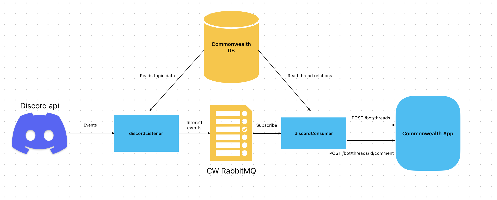

# Discobot

## Contents

- [Discobot](#discobot)
  * [Overview](#overview)
  * [Deployments](#deployments)
    + [Production](#production)
    + [Staging](#staging)
  * [Discord Apps (Bots)](#discord-apps-bots)
    + [Configuration](#configuration)
  * [Local Setup](#local-setup)
    + [Environment Variables (Local)](#environment-variables-local)
  * [Staging and Production Setup](#staging-and-production-setup)
  * [Testing](#testing)
  * [Change Log](#change-log)

## Overview

“Discobot” refers to the set of entities and interactions that power the Commonwealth <> Discord integration. In particular, this is 3 things:

1. Discord Listener (`/packages/discord-bot/discord-listener/discordListener.ts`), an app that handles incoming events from the Discord API and pushes these events to a RabbitMQ queue.
2. Discord Consumer (`/packages/discord-bot/discord-consumer/discordConsumer.ts`), an app that handles events from the RabbitMQ queue and hits the CW API endpoint to create Threads and Comments.
3. RabbitMQ Instance: a queue has been set up called `discord-message`
4. Commonwealth Manage Community Page (`/packages/commonwealth/…/community_metadata_rows.tsx`), where admins are able to add a bot connection and connect Forum Channels (in a connected Discord Server) to Topics (in the CW forum).

The basic flow here:

## Deployments

### Production

1. Discord Listener: deployed as a worker dyno on the [discobot-listener](https://dashboard.heroku.com/apps/discobot-listener/resources) Heroku app.
2. Discord Consumer: deployed as a worker dyno on the [discobot-listener](https://dashboard.heroku.com/apps/discobot-listener/resources) Heroku app.

### Staging

1. Discord Listener: deployed as a worker dyno on the [discobot-listener-staging](https://dashboard.heroku.com/apps/discobot-listener-staging/resources) Heroku app.
2. Discord Consumer: deployed as a worker dyno on the [discobot-listener-staging](https://dashboard.heroku.com/apps/discobot-listener-staging/resources) Heroku app.

The staging Discobot app is used by the following environments for testing purposes:

- `commonwealth-beta` Heroku app (i.e. QA)
- `commonwealth-frick` Heroku app
- `commonwealth-frack` Heroku app

## Discord Apps (Bots)

All the Discord Bots that are used to build the Commonwealth Discobot functionality are accessible
via the [Discord Developer Portal](https://discord.com/developers/applications) once invited to the
`Dev` team by Dillon or Jake.

- Staging: <https://discord.com/developers/applications/1027997517964644453/information>
- Production: <https://discord.com/developers/applications/1133050809412763719/information>

In addition to being linked to the non-production apps listed above, the staging Discord Bot is used
locally for testing purposes.

### Configuration

All redirect URLs that the bot should support need to be inserted/

## Local Setup

### Environment Variables (Local)

#### In `packages/discord-bot/.env` create the following environment variables

- `DISCORD_TOKEN`:This is the token of the staging Discord bot.
  - This variable cannot be found on the Discord developer portal (once created it is hidden). To get this
  variable view the config vars of the [`discobot-listener-staging` Heroku app](https://dashboard.heroku.com/apps/discobot-listener-staging/settings)
  or contact one of the following: Jake, Timothee, Ian
- `CW_BOT_KEY`: This can be any random string, but it must match `CW_BOT_KEY` in `packages/commonwealth/.env`

#### In `packages/commonwealth/.env` create the following environment variables

- `DISCORD_CLIENT_ID`: this is the client ID of the Discord app.
  - For local test we use the staging Discord app/bot. The client ID can therefore be found on the [developer dashboard](https://discord.com/developers/applications/1027997517964644453/oauth2/general)
  or by contacting Jake or Timothee.
- `DISCORD_BOT_TOKEN`: this is the same as the `DISCORD_TOKEN` in `/discord-bot/.env`
- `CW_BOT_KEY`: this is the same as the `CW_BOT_KEY` in `/discord-bot/.env`

### Startup

1. Start a local RabbitMQ instance by executing `pnpm start-rmq` in the root directory (requires Docker).
2. In a separate terminal execute `pnpm start` in `packages/discord-bot/` to start the Discord Listener
3. In a separate terminal execute `pnpm start-consumer` in `packages/discord-bot/` to start the Discord Consumer

## Staging and Production Setup

The following instructions apply to both staging and production environments but note that
the correct app and bot should be used in each instance. For example, the staging environments
should only use tokens and other environment variables from the staging Discord Bot.

### Environment Variables (Staging and Production)

#### Discobot app (discobot-listener or discobot-listener-staging)

- `CLOUDAMQP_URL`: This is the URI of the RabbitMQ (CloudAMQP provider) instance that the Discobot consumer should
connect to. For the staging environments this will be the `CLOUDAMQP_URL` environment variable in the
[`commonwealth-frick` Heroku app](https://dashboard.heroku.com/apps/commonwealth-frick/settings). For production this is
the `CLOUDAMQP_URL` environment variable in the [`commonwealthapp` Heroku app](https://dashboard.heroku.com/apps/commonwealth-beta/settings).
- `CLOUDAMQP_APIKEY`: Same principle as `CLOUDAMQP_URL`.
- `CW_BOT_KEY`: A strong password that matches `CW_BOT_KEY` in the [`commonwealthapp` Heroku app](https://dashboard.heroku.com/apps/commonwealth-beta/settings).
- `DATABASE_URL`: Same principles as `CLOUDAMQP_URL` and `CLOUDAMQP_APIKEY` (copy variable from the relevant app).
- `DISCORD_TOKEN`: This is the token of the staging or production Discord bot.
  - This variable cannot be found on the Discord developer portal (once created it is hidden).
- `DL_BUILD`: Should be set to 'true'.
  - This ensures that Heroku only builds the Discobot package and related code when deploying.
- `PROCFILE`: Should be set to `packages/discord-bot/Procfile`
  - This tells Heroku which Procfile in the repository to use when deploying the app since we use multi-procfile setup.
- `SERVER_URL`: This should be set to the URL of the Heroku app the Discobot is associated to. This will be
`https://commonwealth.im` for the production.

#### Associated Heroku App (commonwealth-frick or commonwealthapp)

- `DISCORD_CLIENT_ID`: this is the client ID of the Discord app.
  - The client ID can be found on the developer dashboard for the [staging bot](https://discord.com/developers/applications/1027997517964644453/oauth2/general)
      or the [production bot](https://discord.com/developers/applications/1133050809412763719/oauth2/general).
  The client ID can also be retrieved by contacting Jake or Timothee.
- `DISCORD_BOT_TOKEN`: this is the same as the `DISCORD_TOKEN` in the associated `Discobot app` above.
- `CW_BOT_KEY`: this is the same as the `CW_BOT_KEY` in the associated `Discobot app` above.

## Testing

### Pre-Requisites

You must have admin permissions on a server of your choice that has a [Discord Community Forum channel](https://support.discord.com/hc/en-us/articles/6208479917079-Forum-Channels-FAQ).
It is recommended to create your own personal testing server with the above channel. It only takes a few seconds to set up.

### After having completed the above pre-requisites and startup steps (if testing locally) follow these steps to test the Discobot functionality

1. Start the commonwealth app (if testing locally).
2. Create a starter community or navigate to a community you are an admin of (the community must not have previously
   been linked to a Discord bot).
3. Navigate to the 'Manage community' admin page.
4. Find the Commonbot Settings section and click on the button to connect Discord.
5. Go through the authorization flow to add the bot to one of your Discord servers.
6. Once completed and redirected to the Commonwealth app, refresh to see the updated connection information.
7. Create a new topic.
8. Link the Discord community forum channel to the topic you created.
9. Congratulations! Discobot will now sync all the future posts and comments from the forum channel to your Commonwealth topic.

## Change Log

- 231102: Updated by and certified fresh by Timothee Legros - Full rewrite of everything except the diagrams section.
- 231025: Flagged by Timothee Legros - local testing instructions do not work. Updates needed for discobot-staging
and Frick setup instructions (e.g. Discord server must have community enabled).
- 231006: Ownership transferred to Ian Rowan.
- 230718: Authored by Alex Young.
