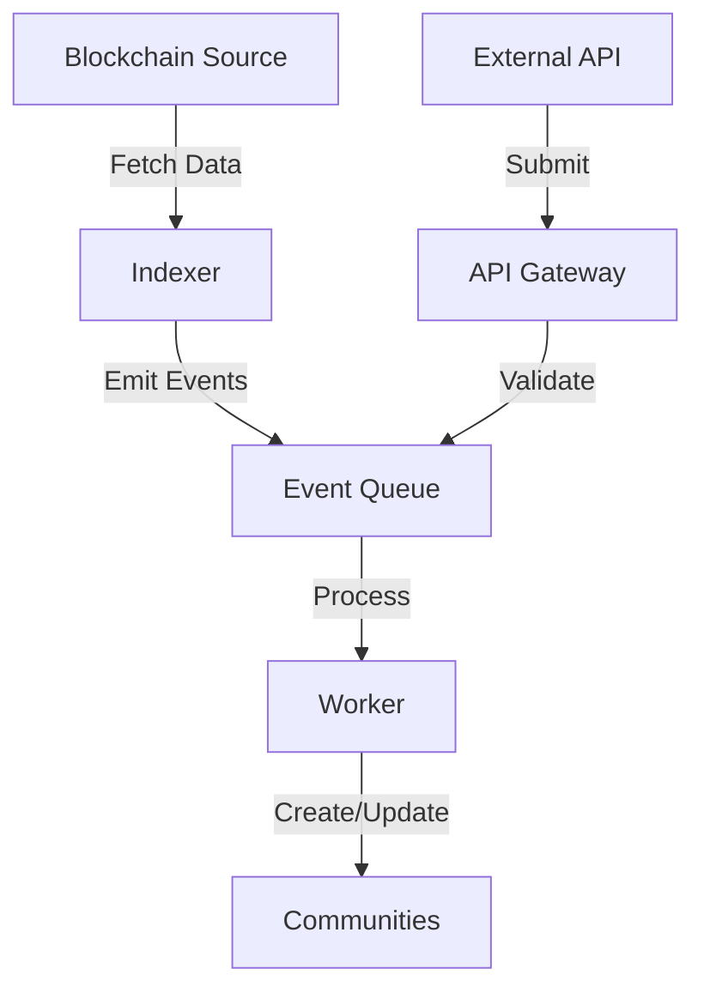

# Community Indexer System Overview

## Architecture

The Commonwealth community indexer system is designed to be flexible and extensible, supporting multiple blockchain networks and community sources. Here's how it works:

### Core Components

1. **Community Indexers**
   - Database table tracking indexer status and configuration
   - Supports multiple indexers (e.g., Clanker, Uniswap, etc.)
   - Each indexer can be configured independently

2. **Community Model**
   - Enhanced with `community_indexer_id` to track source
   - Supports chain-specific metadata
   - Maintains relationships with tokens and other entities

3. **Event System**
   - Uses event-driven architecture
   - Supports both internal and external event sources
   - Handles rate limiting and backpressure

4. **Worker System**
   - Processes events asynchronously
   - Supports multiple worker types
   - Handles retries and error recovery

### Data Flow

## Types of Indexers

### 1. Internal Indexers
- Built and maintained by Commonwealth
- Run on Commonwealth infrastructure
- Examples: Clanker, Uniswap

### 2. External Indexers
- Built by third-party developers
- Run on external infrastructure
- Communicate via API
- Require API key authentication

### 3. Chain-Specific Indexers
- Optimized for specific blockchain networks
- Handle chain-specific data formats
- Support network-specific features

## Key Features

### 1. Automated Community Creation
- Automatic community setup
- Token integration
- Metadata management
- Image processing

### 2. Real-time Updates
- Event-driven updates
- Webhook support
- Rate limiting
- Error handling

### 3. Monitoring & Management
- Health checks
- Status tracking
- Error reporting
- Performance metrics

### 4. Security
- API key authentication
- Rate limiting
- Input validation
- Access control

## Use Cases

1. **Token Communities**
   - Create communities for new tokens
   - Track token holders
   - Manage token governance

## Technical Requirements

### For Internal Developers
- Node.js/TypeScript knowledge
- Understanding of blockchain networks
- Familiarity with event systems
- Database knowledge

### For External Developers
- API integration capabilities
- Understanding of authentication
- Rate limiting implementation
- Error handling

## Next Steps

1. For internal developers: See [Internal Development Guide](./internal-guide.md)
2. For external developers: See [External Integration Guide](./external-guide.md)
3. For chain-specific implementations: See the guides in the [chains](./chains/) directory 