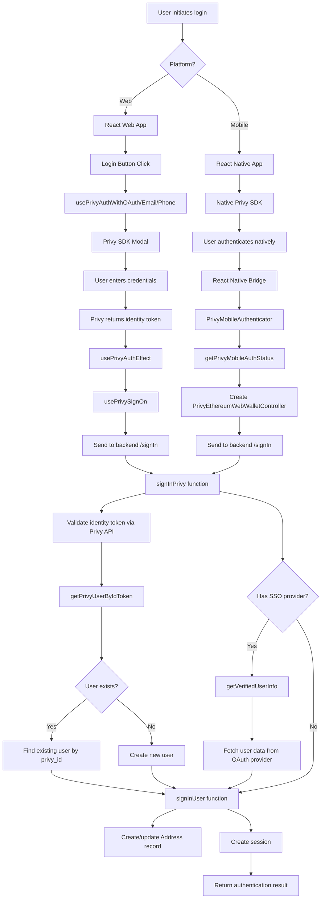
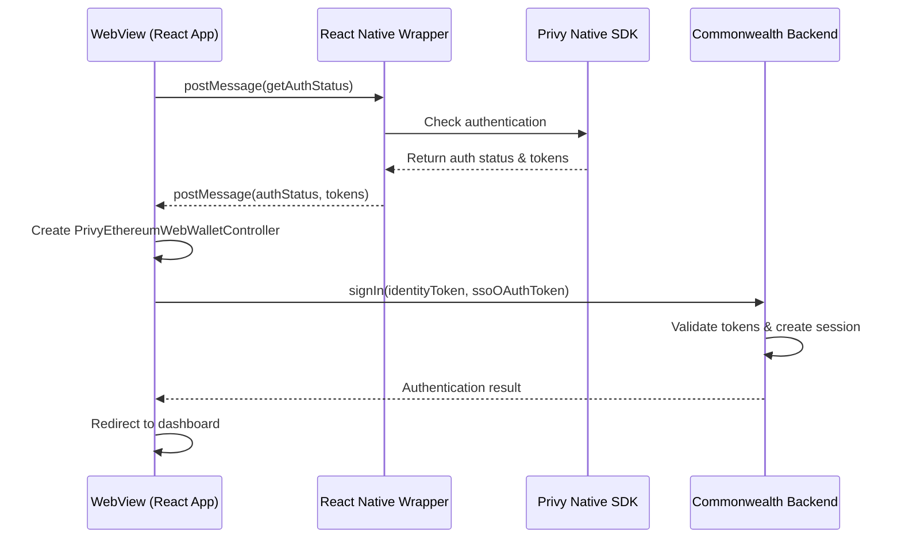

# Commonwealth Privy Authentication Implementation Guide

## Table of Contents
1. [Overview](#overview)
2. [Architecture Overview](#architecture-overview)
3. [Frontend Implementation](#frontend-implementation)
4. [Backend Implementation](#backend-implementation)
5. [Mobile Implementation](#mobile-implementation)
6. [Configuration & Environment](#configuration--environment)
7. [User Flows](#user-flows)
8. [Component Reference](#component-reference)
9. [Feature Flag Integration](#feature-flag-integration)
10. [Security Considerations](#security-considerations)
11. [Testing & Development](#testing--development)

## Overview

Privy is an authentication and wallet management service integrated into Commonwealth to provide seamless user authentication across multiple platforms (web and mobile) and authentication methods (OAuth, email, SMS, crypto wallets). This implementation is currently behind a feature flag as it's in testing mode.

### Key Features
- **Multi-platform support**: Web (React) and Mobile (React Native WebView)
- **Multiple auth methods**: Google, Discord, Twitter, Apple, GitHub, Email, SMS, Farcaster, Crypto Wallets
- **Embedded wallets**: Creates wallets for users who don't have their own
- **SSO integration**: Seamless integration with existing social accounts
- **Session management**: Secure token-based authentication with Commonwealth backend

## Architecture Overview

The Privy integration follows a three-tier architecture:



## Frontend Implementation

### Core Provider Setup

The Privy integration is initialized at the root level in `App.tsx`:

```typescript
// App.tsx structure
<PrivyMobileAuthenticator>
  <DefaultPrivyProvider>
    <ForceMobileAuth>
      <OnBoardingWrapperForMobile>
        <RouterProvider router={router()} />
      </OnBoardingWrapperForMobile>
    </ForceMobileAuth>
  </DefaultPrivyProvider>
</PrivyMobileAuthenticator>
```

### 1. DefaultPrivyProvider

**Location**: `packages/commonwealth/client/scripts/views/components/DefaultPrivyProvider/`

This is the main entry point that wraps the application in Privy's authentication context.

#### LoadPrivy.tsx
- Initializes the `@privy-io/react-auth` PrivyProvider
- Configures authentication methods and appearance
- Fetches configuration from environment variables

**Key Configuration**:
```typescript
const config = {
  loginMethods: [
    'google', 'discord', 'twitter', 'apple', 'github', 
    'email', 'farcaster', 'sms', 'wallet'
  ],
  appearance: {
    theme: darkMode ? 'dark' : 'light',
    logo: `https://${PRODUCTION_DOMAIN}/brand_assets/common.png`,
  },
  embeddedWallets: {
    ethereum: {
      createOnLogin: 'users-without-wallets',
    },
  },
}
```

#### WaitForPrivy.tsx
- Displays loading indicator until Privy SDK is ready
- Uses `usePrivy().ready` to determine when to render children
- Prevents app from rendering in partially authenticated state

### 2. Authentication Hooks

**Location**: `packages/commonwealth/client/scripts/views/components/Privy/`

#### Core Authentication Hooks

1. **usePrivyAuthWithOAuth.ts**
   - Handles OAuth providers (Google, Discord, Twitter, Apple, GitHub)
   - Uses `useLoginWithOAuth` from Privy SDK
   - Manages OAuth token state and provider selection

2. **usePrivyAuthWithEmail.ts**
   - Handles email authentication
   - Works with `PrivyEmailDialog` for code verification

3. **usePrivyAuthWithPhone.ts**
   - Handles SMS authentication
   - Works with `PrivySMSDialog` for code verification

4. **usePrivyAuthEffect.ts**
   - Central effect hook that orchestrates authentication
   - Connects authentication flow to sign-in process
   - Handles state management during authentication

5. **usePrivySignOn.ts**
   - Manages the actual sign-in process with Commonwealth backend
   - Creates session and sends authentication payload
   - Handles success/error callbacks

#### UI Components

1. **LoginWithGoogle.tsx**, **LoginWithEmail.tsx**, **LoginWithPhone.tsx**
   - Individual login button components
   - Trigger respective authentication hooks
   - Handle loading states and user feedback

2. **Dialog Components**
   - `PrivyEmailDialog.tsx`: Email verification code input
   - `PrivySMSDialog.tsx`: SMS verification code input
   - `CodeDialog.tsx`: Shared verification code UI component

#### Helper Functions

**helpers.ts**:
```typescript
export function toSignInProvider(
  provider: WalletSsoSource | OAuthProvider,
): PrivySignInSSOProvider {
  // Maps provider types between Privy and Commonwealth enums
}
```

### 3. State Management

**Location**: `packages/commonwealth/client/scripts/views/components/Privy/stores/`

- **usePrivyEmailDialogStore.tsx**: Manages email dialog state
- **usePrivySMSDialogStore.tsx**: Manages SMS dialog state

These stores handle dialog visibility, callbacks, and error states.

## Backend Implementation

### Core Files

**Location**: `libs/model/src/aggregates/user/signIn/`

### 1. Entry Point - privy.ts

The main `signInPrivy` function orchestrates the entire backend authentication flow:

```typescript
export async function signInPrivy({
  payload,
  verificationData,
  signedInUser,
  ethChainId,
}: {
  payload: z.infer<(typeof schemas.SignIn)['input']>;
  verificationData: {
    verification_token: string;
    verification_token_expires: Date;
  };
  signedInUser?: UserAttributes | null;
  ethChainId?: number;
})
```

**Key Steps**:
1. Validates wallet ID is Privy
2. Validates presence of identity token
3. Verifies token with Privy API
4. Checks user ownership of wallet address
5. Handles SSO provider verification
6. Calls `signInUser` for final processing

### 2. Privy Utilities - privyUtils.ts

Contains server-side Privy client and utility functions:

```typescript
export const privyClient = new PrivyClient(
  config.PRIVY.APP_ID!,
  config.PRIVY.APP_SECRET!,
);

export async function getPrivyUserById(id: string)
export async function getPrivyUserByIdToken(idToken: string)
```

### 3. User Management - utils.ts

The `signInUser` function handles the core user management logic:

- **User lookup**: Finds existing user by privy_id, address, or SSO info
- **User creation**: Creates new user if not found
- **Address management**: Creates/updates address records
- **Transfer logic**: Handles address ownership transfers between users
- **Session creation**: Establishes user session

### 4. SSO Verification - getVerifiedUserInfo.ts

**Location**: `libs/model/src/utils/oauth/getVerifiedUserInfo.ts`

Fetches verified user information from social providers:

```typescript
export async function getVerifiedUserInfo({
  magicMetadata,
  privyUser,
  token,
  walletSsoSource,
}: {
  magicMetadata?: MagicUserMetadata;
  privyUser?: PrivyUser;
  walletSsoSource: WalletSsoSource;
  token?: string;
}): Promise<VerifiedUserInfo>
```

**Supported Providers**:
- Twitter: Fetches username via API
- Discord: Fetches email, verification status, username
- GitHub: Fetches username
- Google: Fetches email and verification status
- Apple: Uses Privy/Magic metadata for email
- SMS: Uses phone number from metadata
- Farcaster: Uses FID as username
- Email: Uses email from metadata

## Mobile Implementation

### Overview

The mobile implementation is more complex due to its hybrid architecture. It runs Commonwealth's React web app inside a WebView within a React Native application, using a custom bridge to communicate with the native Privy SDK.

### Key Components

#### 1. PrivyMobileAuthenticator.tsx

**Location**: `packages/commonwealth/client/scripts/views/components/PrivyMobile/`

This is the central orchestrator for mobile authentication:

```typescript
export const PrivyMobileAuthenticator = (props: Props) => {
  // Only activates when window.PRIVY_MOBILE_ENABLED is true
  // Communicates with React Native wrapper via postMessage
  // Handles authentication flow and wallet integration
}
```

**Authentication Flow**:
1. Checks if running in mobile environment (`window.PRIVY_MOBILE_ENABLED`)
2. Gets authentication status from React Native wrapper
3. If authenticated, creates `PrivyEthereumWebWalletController`
4. Signs in to Commonwealth backend
5. Redirects to dashboard on success

#### 2. Mobile Bridge Hooks

- **usePrivyMobileAuthStatus.ts**: Gets auth status from native layer
- **usePrivyMobileLogout.ts**: Handles logout through native layer
- **usePrivyMobileSignMessage.ts**: Signs messages via native wallet
- **usePrivyEthereumWalletRequest.ts**: Handles wallet requests
- **usePrivyEthereumWalletOn.ts**: Handles wallet events

#### 3. PrivyEthereumWebWalletController.ts

**Location**: `packages/commonwealth/client/scripts/controllers/app/webWallets/`

Custom wallet controller that implements `IWebWallet` interface:

- Bridges wallet operations from WebView to native mobile wallet
- Handles message signing through React Native bridge
- Manages Ethereum provider interactions
- Enables wallet functionality within WebView context

**Key Methods**:
```typescript
class PrivyEthereumWebWalletController {
  constructor(
    private etheriumProvider: () => any,
    private signMessageProvider: (message: string) => Promise<string>,
  )
  
  public async enable(forceChainId?: string)
  public getSessionSigner()
  public async switchNetwork(chainId?: string)
}
```

### Mobile Communication Flow



## Configuration & Environment

### Environment Variables

**Frontend**:
- `PRIVY_APP_ID`: Public Privy application ID (exposed to client)

**Backend**:
- `PRIVY_APP_ID`: Privy application ID
- `PRIVY_APP_SECRET`: Privy application secret (server-side only)

### Configuration Flow

1. **Client Configuration**: `fetchCachedPublicEnvVar()` retrieves public config including `PRIVY_APP_ID`
2. **Server Configuration**: Uses `config.PRIVY` object with both APP_ID and APP_SECRET
3. **Privy Client**: Initialized with both credentials for server-to-server communication

### Feature Flag Integration

The Privy integration is controlled by the `privy` feature flag:

```typescript
const privyEnabled = useFlag('privy');
```

**Usage locations**:
- `SublayoutHeader/AuthButtons.tsx`
- `SublayoutHeader/useUserMenuItems.tsx`
- `AuthModal/useAuthentication.tsx`

**Note**: The `DefaultPrivyProvider` always loads regardless of the feature flag because Privy requires initialization before it can be conditionally used.

## User Flows

### Web Authentication Flow

1. **User Action**: Clicks login button (Google, Email, etc.)
2. **Hook Trigger**: Appropriate auth hook (`usePrivyAuthWithOAuth`, etc.) is called
3. **Privy Modal**: Privy SDK displays authentication modal
4. **User Authentication**: User enters credentials in Privy interface
5. **Token Receipt**: Privy returns identity token and optional OAuth token
6. **Effect Trigger**: `usePrivyAuthEffect` processes tokens
7. **Sign On**: `usePrivySignOn` sends tokens to Commonwealth backend
8. **Backend Validation**: `signInPrivy` validates tokens with Privy API
9. **User Management**: Backend creates/updates user and session
10. **Success**: User is logged in and redirected

### Mobile Authentication Flow

1. **Native Authentication**: User authenticates through React Native Privy SDK
2. **Status Check**: WebView checks authentication status via bridge
3. **Token Transfer**: Native layer provides identity and OAuth tokens
4. **Wallet Creation**: Creates `PrivyEthereumWebWalletController` for WebView
5. **Backend Authentication**: Same backend flow as web
6. **Session Creation**: User session established in WebView
7. **Redirect**: User redirected to dashboard

### Email/SMS Verification Flow

1. **Initial Request**: User enters email/phone number
2. **Code Send**: Privy sends verification code
3. **Dialog Display**: Verification dialog appears
4. **Code Entry**: User enters verification code
5. **Code Verification**: Privy validates code
6. **Authentication**: Standard authentication flow continues

## Component Reference

### Core Components

| Component | Location | Purpose |
|-----------|----------|---------|
| `DefaultPrivyProvider` | `/DefaultPrivyProvider/` | Main Privy integration wrapper |
| `LoadPrivy` | `/DefaultPrivyProvider/` | Initializes Privy SDK |
| `WaitForPrivy` | `/DefaultPrivyProvider/` | Loading state management |
| `PrivyMobileAuthenticator` | `/PrivyMobile/` | Mobile authentication orchestrator |

### Authentication Hooks

| Hook | Purpose | Returns |
|------|---------|---------|
| `usePrivyAuthWithOAuth` | OAuth provider authentication | `{ onInitOAuth, authenticated, logout, loading }` |
| `usePrivyAuthWithEmail` | Email authentication | `{ onInitEmail, authenticated, logout, loading }` |
| `usePrivyAuthWithPhone` | SMS authentication | `{ onInitPhone, authenticated, logout, loading }` |
| `usePrivyAuthEffect` | Core authentication logic | Callback function |
| `usePrivySignOn` | Commonwealth sign-in | Sign-in function |

### UI Components

| Component | Purpose | Props |
|-----------|---------|-------|
| `LoginWithGoogle` | Google OAuth login button | `PrivyCallbacks` |
| `LoginWithEmail` | Email login form | `PrivyCallbacks` |
| `LoginWithPhone` | SMS login form | `PrivyCallbacks` |
| `PrivyEmailDialog` | Email verification dialog | None (uses store) |
| `PrivySMSDialog` | SMS verification dialog | None (uses store) |
| `CodeDialog` | Shared verification UI | `{ onComplete, onCancel, headerText }` |

### Mobile Components

| Component | Purpose |
|-----------|---------|
| `PrivyMobileAuthenticator` | Mobile auth orchestrator |
| `PrivyEthereumWebWalletController` | WebView wallet controller |
| Various mobile bridge hooks | Native communication |

## Security Considerations

### Current Security Issues

1. **High Severity - Token Logging**
   - **Issue**: `ssoOAuthToken` and user PII may be logged at trace level
   - **Location**: `privyUtils.ts` logging statements
   - **Risk**: Account takeover if logs are compromised
   - **Mitigation**: Sanitize logs, disable trace logging in production

2. **Medium Severity - Mobile Redirect**
   - **Issue**: Uses `setTimeout` with `document.location.href` for redirects
   - **Location**: `PrivyMobileAuthenticator.tsx:163`
   - **Risk**: Race conditions, unreliable redirects
   - **Mitigation**: Use React Router navigation hooks

3. **Low Severity - Component Naming**
   - **Issue**: `PrivyEthereumWebWalletController.name` hardcoded as `WalletId.Metamask`
   - **Location**: `privy_ethereum_web_wallet.ts:21`
   - **Risk**: Confusion, incorrect analytics
   - **Mitigation**: Change to `WalletId.Privy`

### Security Best Practices

1. **Token Handling**:
   - Identity tokens validated server-side with Privy API
   - OAuth tokens used only for verified user info fetching
   - Tokens not stored client-side beyond authentication flow

2. **Session Management**:
   - Secure session creation through existing Commonwealth system
   - Proper user-address linking and verification
   - Support for user transfer between accounts

3. **Mobile Security**:
   - WebView limited to Commonwealth domain
   - Native-WebView bridge minimized to essential functions
   - Authentication handled in secure native context

## Testing & Development

### Development Setup

1. **Environment Variables**: Ensure `PRIVY_APP_ID` and `PRIVY_APP_SECRET` are configured
2. **Feature Flag**: Enable `privy` feature flag for testing
3. **Mobile Testing**: Set `window.PRIVY_MOBILE_ENABLED = true` for mobile flow testing

### Testing Considerations

1. **Unit Tests**: Test individual hooks and components
2. **Integration Tests**: Test complete authentication flows
3. **Mobile Tests**: Test WebView-Native bridge communication
4. **Security Tests**: Verify token validation and user management
5. **Error Handling**: Test error scenarios and edge cases

### Mock Support

The backend includes mock support for testing:
- `privyUtils.ts` is separated for easy mocking
- Test utilities available in `/test/` directories
- Mock implementations for `getVerifiedUserInfo`

### Debugging

1. **Frontend**: Check browser console for Privy SDK logs
2. **Backend**: Monitor trace logs (carefully, due to security concerns)
3. **Mobile**: Check React Native debugger for bridge communications
4. **Network**: Monitor API calls to Privy and Commonwealth endpoints

---

*This documentation provides a comprehensive guide to the Privy authentication implementation in Commonwealth. For implementation details, refer to the source files mentioned throughout this document.* 