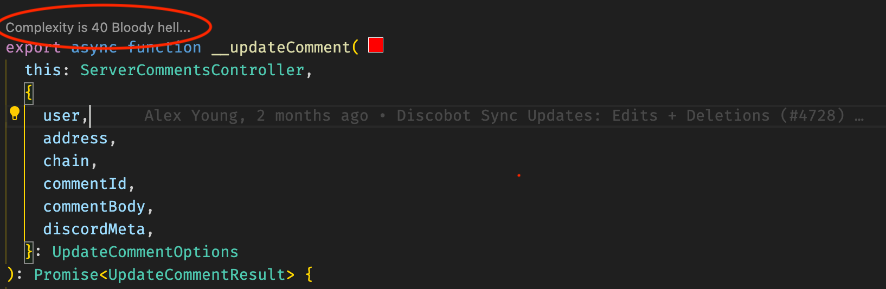
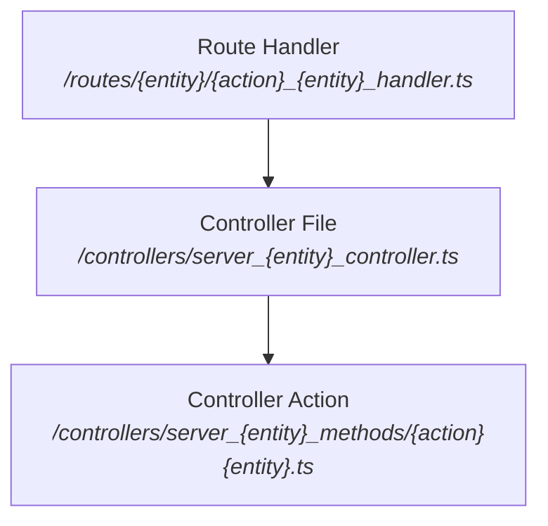

# Complex Functions

> Functions that attempt to perform multiple tasks, thus violating the single responsibility principle (SRP), and the Don't Repeat Yourself (DRY) principle.

We can find many examples in our codebase!



## Server Architecture Background

Our server (API) adheres to a conventional technical architecture that relies on routes, controllers, and ORM-based data model abstractions. The REST API routes are configured in `/routing/router.ts`, where specific controller instances are linked to either models or server controllers, a form of dependency inversion.

```typescript
// controller can be bound to models or serverControllers
const controller = handler.bind(this, models)
// or
const controller = handler.bind(this, serverControllers)

registerRoute(VERB, path, ...[auth, validations, controller])
```

### Project Structure



## Refactoring Responsibilities

The majority of exposed API routes manage **imperative actions** initiated by human actors, often referred to as **Commands** in Domain Driven Design. These actions typically adhere to a pattern of steps that can be mapped to *`responsibilities`*:

1. Authorize Command Execution - *`Auth`*
2. Message Schema Validation - *`Schemas`*
3. Route Command - *`Routing`*
4. Load Aggregate - *`Repository`*
5. Validate Invariants (Business Rules) - *`Business Invariants`*
6. Apply Command to Aggregate - *`Business Rules`*
7. Persist Mutations - *`Repository`*
8. Publish Events (In a Reactive System) - *`Messaging`*
9. Return Command Results - *`Schemas`*

### Opportunity

We have the opportunity to refactor our stack with a structure that follows the single responsibility principle, however, this should be done in small, incremental steps. Before proceeding, we need to establish a pattern for decomposing the current code. Let's examine one specific example of existing code to better understand the refactoring process:

### Example

`/server/controllers/server_comments_methods/update_comments.ts`

```typescript
// ...imports section
```

`Schemas`

```typescript
export type UpdateCommentOptions = {
  user: UserInstance;
  address: AddressInstance;
  chain: ChainInstance;
  commentId?: number;
  commentBody: string;
  discordMeta?: any;
};

export type UpdateCommentResult = [CommentAttributes, EmitOptions[]];
```

`Repository + Business Invariants`

```typescript
export async function __updateComment(
  this: ServerCommentsController,
  {
    user,
    address,
    chain,
    commentId,
    commentBody,
    discordMeta,
  }: UpdateCommentOptions
): Promise<UpdateCommentResult> {
  if (!commentId && !discordMeta) {
    throw new AppError(Errors.NoId);
  }

  if (discordMeta !== undefined && discordMeta !== null) {
    const existingComment = await this.models.Comment.findOne({
      where: { discord_meta: discordMeta },
    });
    if (existingComment) {
      commentId = existingComment.id;
    } else {
      throw new AppError(Errors.NoId);
    }
  }

  // check if banned
  const [canInteract, banError] = await this.banCache.checkBan({
    chain: chain.id,
    address: address.address,
  });
  if (!canInteract) {
    throw new AppError(`${Errors.BanError}: ${banError}`);
  }
```

`Repository`

```typescript
  const userOwnedAddressIds = (await user.getAddresses())
    .filter((addr) => !!addr.verified)
    .map((addr) => addr.id);
  const comment = await this.models.Comment.findOne({
    where: {
      id: commentId,
      address_id: { [Op.in]: userOwnedAddressIds },
    },
  });

  const thread = await this.models.Thread.findOne({
    where: { id: comment.thread_id },
  });
  if (!thread) {
    throw new AppError(Errors.ThreadNotFoundForComment);
  }

  let latestVersion;
  try {
    latestVersion = JSON.parse(comment.version_history[0]).body;
  } catch (e) {
    console.log(e);
  }
```
  
`Business Rules`

```typescript
  // If new comment body text has been submitted, create another version history entry
  if (decodeURIComponent(commentBody) !== latestVersion) {
    const recentEdit = {
      timestamp: moment(),
      body: decodeURIComponent(commentBody),
    };
    const arr = comment.version_history;
    arr.unshift(JSON.stringify(recentEdit));
    comment.version_history = arr;
  }
  comment.text = commentBody;
  comment.plaintext = (() => {
    try {
      return renderQuillDeltaToText(
        JSON.parse(decodeURIComponent(commentBody))
      );
    } catch (e) {
      return decodeURIComponent(commentBody);
    }
  })();
```

`Repository`
  
```typescript
  await comment.save();
  const finalComment = await this.models.Comment.findOne({
    where: { id: comment.id },
    include: [this.models.Address],
  });
```

`Messaging`
  
```typescript
  const cwUrl = getThreadUrl(thread, comment?.id);
  const root_title = thread.title || '';

  const allNotificationOptions: EmitOptions[] = [];

  allNotificationOptions.push({
    notification: {
      categoryId: NotificationCategories.CommentEdit,
      data: {
        created_at: new Date(),
        thread_id: comment.thread_id,
        root_title,
        root_type: ProposalType.Thread,
        comment_id: +finalComment.id,
        comment_text: finalComment.text,
        chain_id: finalComment.chain,
        author_address: finalComment.Address.address,
        author_chain: finalComment.Address.chain,
      },
    },
    excludeAddresses: [finalComment.Address.address],
  });

  let mentions;
  try {
    const previousDraftMentions = parseUserMentions(latestVersion);
    const currentDraftMentions = parseUserMentions(
      decodeURIComponent(commentBody)
    );
    mentions = currentDraftMentions.filter((addrArray) => {
      let alreadyExists = false;
      previousDraftMentions.forEach((addrArray_) => {
        if (addrArray[0] === addrArray_[0] && addrArray[1] === addrArray_[1]) {
          alreadyExists = true;
        }
      });
      return !alreadyExists;
    });
  } catch (e) {
    throw new AppError(Errors.ParseMentionsFailed);
  }

  // grab mentions to notify tagged users
  let mentionedAddresses;
  if (mentions?.length > 0) {
    mentionedAddresses = await Promise.all(
      mentions.map(async (mention) => {
        const mentionedUser = await this.models.Address.findOne({
          where: {
            chain: mention[0],
            address: mention[1],
          },
          include: [this.models.User],
        });
        return mentionedUser;
      })
    );
    // filter null results
    mentionedAddresses = mentionedAddresses.filter((addr) => !!addr);
  }

  // notify mentioned users, given permissions are in place
  if (mentionedAddresses?.length > 0) {
    mentionedAddresses.forEach((mentionedAddress) => {
      if (!mentionedAddress.User) {
        return; // some Addresses may be missing users, e.g. if the user removed the address
      }
      allNotificationOptions.push({
        notification: {
          categoryId: NotificationCategories.NewMention,
          data: {
            mentioned_user_id: mentionedAddress.User.id,
            created_at: new Date(),
            thread_id: +comment.thread_id,
            root_title,
            root_type: ProposalType.Thread,
            comment_id: +finalComment.id,
            comment_text: finalComment.text,
            chain_id: finalComment.chain,
            author_address: finalComment.Address.address,
            author_chain: finalComment.Address.chain,
          },
        },
        excludeAddresses: [finalComment.Address.address],
      });
    });
  }
```

  `Repository`

```typescript
  // update address last active
  address.last_active = new Date();
  address.save();
```
  
  `Schemas`

```typescript
  return [finalComment.toJSON(), allNotificationOptions];
}
```

## Solution

We can establish a straightforward "conventional framework" designed to delineate business requirements from the technical implementation details. By leveraging well-established behavioral and creational design patterns like the chain of responsibility, builder, and repository, we can boost development efficiency and code robustness. This framework should also support the automated generation of a significant portion of the code and structure necessary for implementing and documenting new features.

### Components

By adopting the hexagonal architecture approach, a top level application port can take on the role of configuring routes with authentication and schema validations, further delegating various other responsibilities to other dedicated ports, each handling tasks related to persistence, messaging, and more.

We can use the "builder" pattern to initialize the application with various adapters tailored for specific use cases such as unit testing, local development, and production environments.

Additionally, we can employ convention-over-configuration techniques to define the commands we expose through the API, including their schemas and implementation specifics.

```typescript
// something like this - TBD
export const updateComment:Command<Request,Response> = {
  auth: [role1, role2], // RBAC, undefined => anonymous
  body: z.object(...),
  response: z.object(...),
  callback: (actor, body) => {
    ...
  }
}
```

Cross-cutting concerns, such as the choice of API protocol (REST, gRPC) and data repository (in-memory, database dialect), are established within the bootstrapping routine.

```typescript
import { commands } from "./commands"

app(Express(options));

app().with(commands).build();
app().listen()
```

The pseudocode representation of a refactored handler might appear as follows, leaving the developer solely responsible for implementing the business callback interface:

```typescript
// TBD
const command = (actor, body, callback) => {
  // These steps are guaranteed by the framework, including spec documentation
  // 1. Authorize Command Execution - *`Auth`*
  // 2. Message Schema Validation - *`Schemas`*
  // 3. Route Command - *`Routing`*

  try {
    // CORE business - callback configured
    const state, events = callback(actor, body) {
      // Loading step can be placed inside or outside (more generic) the callback - TBD
      // 4. Load Aggregate - *`Repository`*
      const state = await repo().loadBy(...)
      // 5. Validate Invariants (Business Rules) - *`Business Invariants`*
      check invariants or raise Error
      // 6. Apply Command to Aggregate - *`Business Rules`*
      execute rules, mutate state, collect events
      // return new state/events
      return state, events
    }

    // TRANSACTION - OUTBOX PATTERN WHEN PUBLISHING EVENTS
    // 7. Persist Mutations - *`Repository`*
    repo().commit(state)
    // 8. Publish Events (In a Reactive System) - *`Messaging`*
    app().emit(events)
    // TRANSACTION

    // 9. Return Command Results - *`Schemas`*
    return state // the framework normalizes results according to protocol
  } catch(error) {
    // 9. Return Normalized Error Response (according to protocol)
  }
}
```
