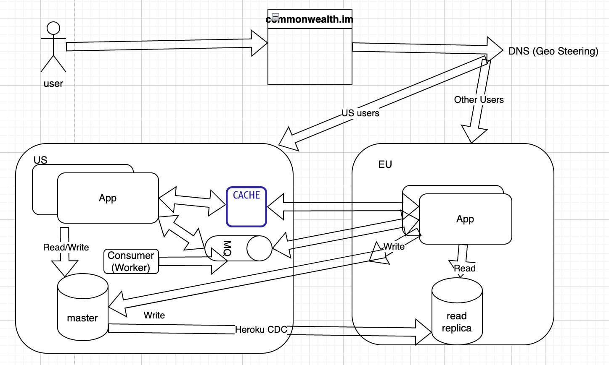
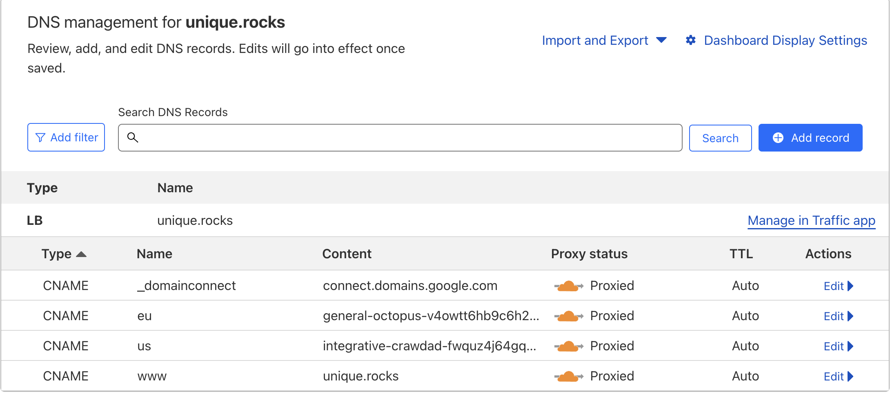

## Contents

- [Architecture](#architecture)
- [Implementation](#implementation)
  * [Database Replication at the Platform Level](#database-replication-at-the-platform-level)
  * [Sequelize Configuration at the Application Level](#sequelize-configuration-at-the-application-level)
  * [Geo Steering at the DNS/CDN Level](#geo-steering-at-the-dns-cdn-level)
- [Test Plan](#test-plan)
  * [Performance - webtest from different regions](#performance---webtest-from-different-regions)
  * [POST - Write Scenarios - Regression](#post---write-scenarios---regression)
  * [Register/Login Scenario(s)](#register-login-scenario-s-)
  * [Notifications/Websockets](#notifications-websockets)
  * [Observability](#observability)
  * [Failure Scenario(s)](#failure-scenario-s-)
  * [Add custom domain](#add-custom-domain)
- [Deployment Plan](#deployment-plan)
  * [One Time Setup](#one-time-setup)
  * [Heroku](#heroku)
    + [Create a new app in the EU region](#create-a-new-app-in-the-eu-region)
    + [Copy all environment variables from the production master app, excluding `DATABASE_URL` and `HEROKU_*`](#copy-all-environment-variables-from-the-production-master-app--excluding--database-url--and--heroku---)
    + [Add a new database replica (follower DB) to follow the master from the master app](#add-a-new-database-replica--follower-db--to-follow-the-master-from-the-master-app)
    + [Add MASTER_DATABASE_URL and READ_DATABASE_URL environment variables to the new app](#add-master-database-url-and-read-database-url-environment-variables-to-the-new-app)
    + [Attach the custom domain eu.commonwealth.im to the new EU app](#attach-the-custom-domain-eucommonwealthim-to-the-new-eu-app)
    + [Attach the custom domain to us.commonwealth.im from the existing app](#attach-the-custom-domain-to-uscommonwealthim-from-the-existing-app)
    + [Detach the domain commonwealth.im from the existing app](#detach-the-domain-commonwealthim-from-the-existing-app)
  * [CDN](#cdn)
  * [Add CNAME entry for region-specific app](#add-cname-entry-for-region-specific-app)
  * [App geo-steering load balancing for root domain](#app-geo-steering-load-balancing-for-root-domain)
- [Release](#release)
- [Change Log](#change-log)

# Architecture



# Implementation

The implementation details can be found at the following GitHub URL: <https://github.com/hicommonwealth/commonwealth/pull/4328>

## Database Replication at the Platform Level

Heroku, as a platform, supports inter-application and inter-region replication. We have successfully provisioned a follower database using these features.

## Sequelize Configuration at the Application Level

The Sequelize Object-Relational Mapping (ORM) possesses primitive functions to facilitate a leader-follower scenario. This includes:

- Designating the master for write operations and the follower for read operations within the Sequelize configuration
- The `useMaster: true` function, which is beneficial when one needs to deliberately redirect read operations to the master. This is particularly useful when retrieving recently written data that may not yet be replicated.

## Geo Steering at the DNS/CDN Level

The root domain can be configured to enable load balancing, which then redirects to the nearest regional application based on the user's geographical location.

# Test Plan

## Performance - webtest from different regions

- To verify this, you can use different VPNs or cloud instances located in various regions.
- Run a set of read and write operations in each region and measure the time taken for each operation.
- The expectation is that read operations will be faster in non-US locations due to the CDN, while write operations should have similar performance.

## POST - Write Scenarios - Regression

- Add tests that create a new object and then immediately fetch SQL statements. Verify that the `useMaster: true` flag is included in the request.
- Also, ensure that you cover all POST endpoints in your tests.

## Register/Login Scenario(s)

- Test registration and login using different methods: wallets, social media, and magic links.
- Ensure you cover various edge cases like wrong credentials, new users, etc.

## Notifications/Websockets

- Test the Websocket functionality using Socket.io. You can do this by simulating different events and checking if the correct notifications are received.
- Pay special attention to the timing, to make sure the notifications are delivered in the correct window.

## Observability

- Check Datadog's reports to verify that latency metrics are reported correctly for different regions, not just US.
- Ensure combined metrics are still being reported when traffic is served from multiple regions.

## Failure Scenario(s)

- To simulate failure, you can use a chaos engineering tool to bring down eu.unique.rocks and check if unique.rocks is still working for all regions.
- Check that in case of a local region application failing or undergoing maintenance, the CDN or DNS load balancer is correctly redirecting users to the master or another available region.

## Add custom domain

- Test the addition of a custom domain in the new setup and make sure everything is working as expected.
- Document any new steps or guidance needed for clients or support.
- Review the steps for adding custom domains and ensure they are still valid: <https://github.com/hicommonwealth/commonwealth/wiki/custom-domains>.

Make sure to track the results of each test, any bugs or issues found, and the steps taken to resolve them. It's also important to test across a variety of devices and browsers to ensure broad compatibility.

# Deployment Plan

## One Time Setup

## Heroku

### Create a new app in the EU region

```bash
APP_NAME="commonwealth-beta-eu"
heroku create $APP_NAME --region eu
```

### Copy all environment variables from the production master app, excluding `DATABASE_URL` and `HEROKU_*`

```bash
# Replace these values with your own
SOURCE_APP_NAME="commonwealth-beta"
APP_NAME="commonwealth-beta-eu"

# Fetch all environment variables from the source app
env_vars=$(heroku config --app $SOURCE_APP_NAME)

# Loop through the environment variables
while IFS= read -r line; do
  # Check if the variable is not DATABASE_URL and does not start with HEROKU_
  if [[ ! "$line" =~ ^DATABASE_URL= ]] && [[ ! "$line" =~ ^HEROKU_ ]]; then
    # Extract variable name and value
    var_name=$(echo "$line" | cut -d= -f1)
    var_value=$(echo "$line" | cut -d= -f2-)
    
    # Set the environment variable in the destination app
    heroku config:set $var_name="$var_value" --app $APP_NAME
  fi
done <<< "$env_vars"
```

### Add a new database replica (follower DB) to follow the master from the master app

```bash
SOURCE_APP_NAME="commonwealth-beta"
APP_NAME="commonwealth-beta-eu"
MASTER_DB=$(heroku pg:info DATABASE_URL -a ${SOURCE_APP_NAME} | grep -i 'Add-on:' | awk '{print $2}')
heroku addons:create heroku-postgresql:standard-0 --follow $MASTER_DB -a $APP_NAME
```

### Add MASTER_DATABASE_URL and READ_DATABASE_URL environment variables to the new app

```bash
APP_NAME="commonwealth-beta-eu"
heroku config:set MASTER_DATABASE_URL=$(heroku config:get DATABASE_URL) --app $APP_NAME

# Wait for the provisioning of the follower DB created in the previous step to finish
heroku config:set READ_DATABASE_URL= --app $APP_NAME
```

### Attach the custom domain eu.commonwealth.im to the new EU app

```bash
APP_NAME="commonwealth-beta-eu"
CUSTOM_DOMAIN=eu.affinity.fun
heroku domains:add $CUSTOM_DOMAIN --app $APP_NAME
```

### Attach the custom domain to us.commonwealth.im from the existing app

```bash
SOURCE_APP_NAME="commonwealth-beta"
CUSTOM_DOMAIN=us.affinity.fun
heroku domains:add $CUSTOM_DOMAIN --app $SOURCE_APP_NAME
```

### Detach the domain commonwealth.im from the existing app

```bash
SOURCE_APP_NAME="commonwealth-beta"
CUSTOM_DOMAIN=affinity.fun
heroku domains:remove $CUSTOM_DOMAIN --app $SOURCE_APP_NAME
```

## CDN

## Add CNAME entry for region-specific app



## App geo-steering load balancing for root domain

- Traffic Steering - [Geo Steering](https://developers.cloudflare.com/load-balancing/understand-basics/traffic-steering/steering-policies/geo-steering/#geo-steering)
- two origins should be added, and a specific geographic region should be selected for each. By specifying all server(s) across all geographic origins according to their preference order, automatic failover between regions can be effectively achieved.

# Release

Perform a regular release by pushing to both the master and regional apps:

```bash
git push heroku master
```

## Change Log

- 230729: Authored by Nakul Manchanda.
