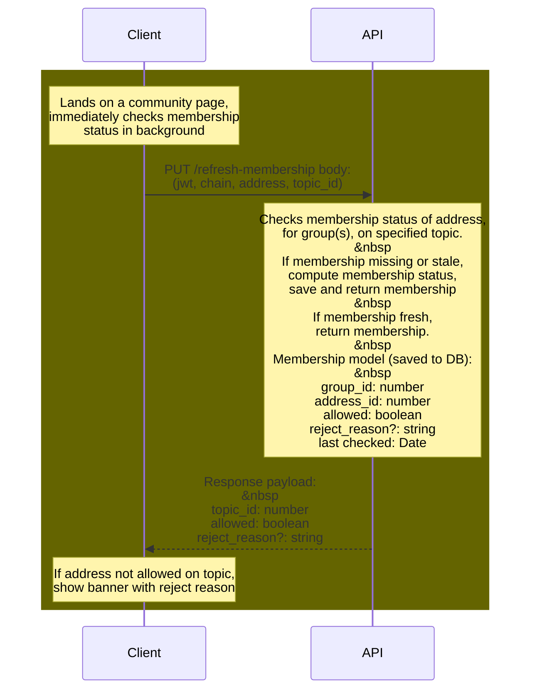
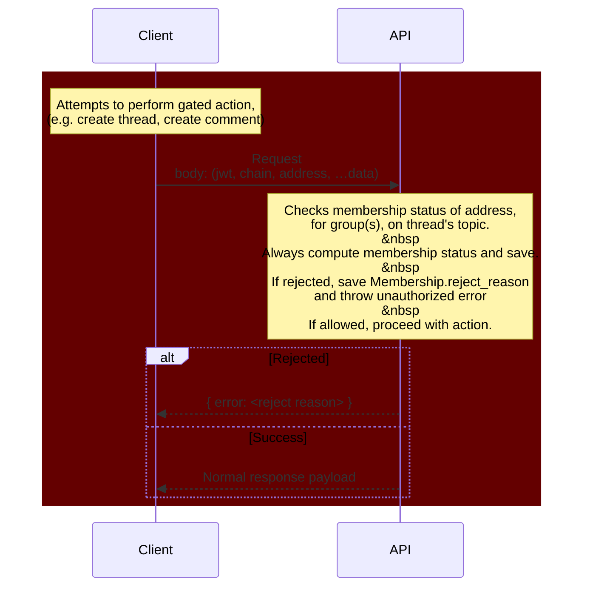

**Contents**
- [API Diagrams](#api-diagrams)
  * [Membership Check](#membership-check)
  * [User Performs Mutation Action](#user-performs-mutation-action)
  * [Create Group](#create-group)
  * [View Group Memberships](#view-group-memberships)
  * [Update/delete Group](#update-delete-group)
- [Change Log](#change-log)

# API Diagrams

## Membership Check

## User Performs Mutation Action

## Create Group

```mermaid
sequenceDiagram

  rect rgb(0, 20, 0)

  Note over Client: Admin creates a Group

  Client->>API: POST /groups <br/> body: (jwt, chain_id, address, metadata, requirements, topics)

  Note over API: Validate schema. <br/> &nbsp <br/> Check limit of 20 groups per chain <br/> &nbsp <br/> Save group <br/> &nbsp <br/> Optionally add group to each specified topic

  API-->>Client: Response payload (Group): <br/> &nbsp <br/> id: number <br/> chain_id: string <br/> metadata: MetadataJSON <br/> requirements: RequirementsJSON

  end
```

## View Group Memberships

## Update/delete Group

```mermaid
sequenceDiagram

  rect rgb(0, 0, 50)

  Note over Client: Admin updates/deletes Group

  Client ->> API: DELETE /groups/:id <br/> body: (jwt, chain_id, address)

  Note over API: Deletes all Memberships of the group, <br/> then updates/deletes the group

  API -->> Client: OK

  end
```

# Change Log

- 231023: Authored by Graham Johnson with initial API diagrams.