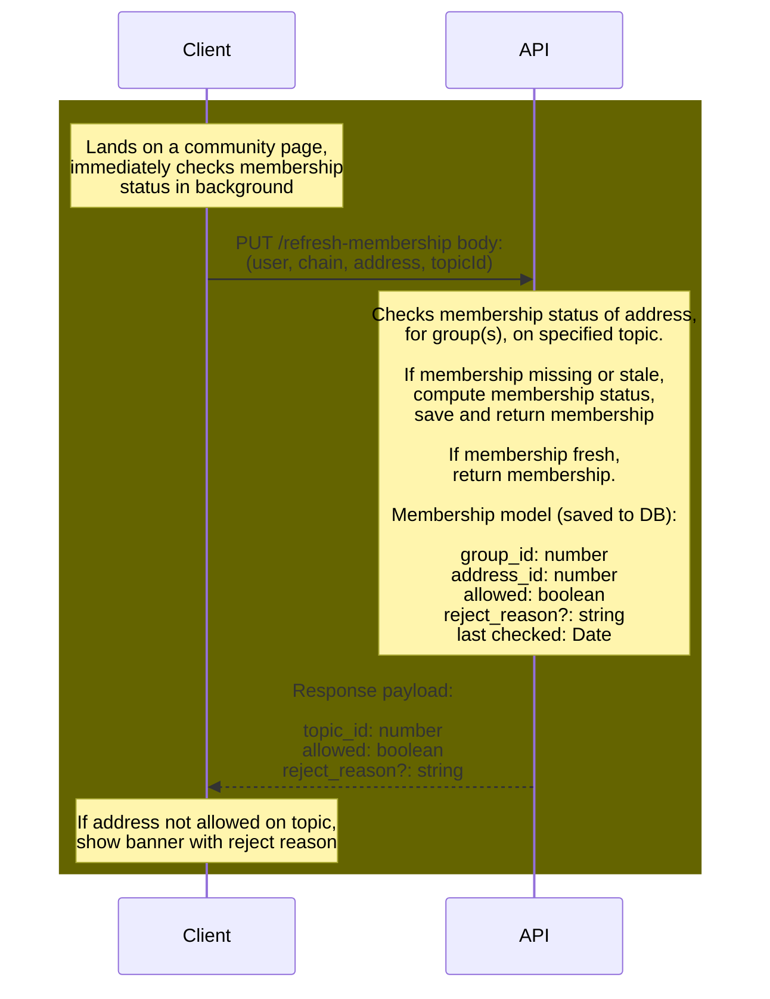
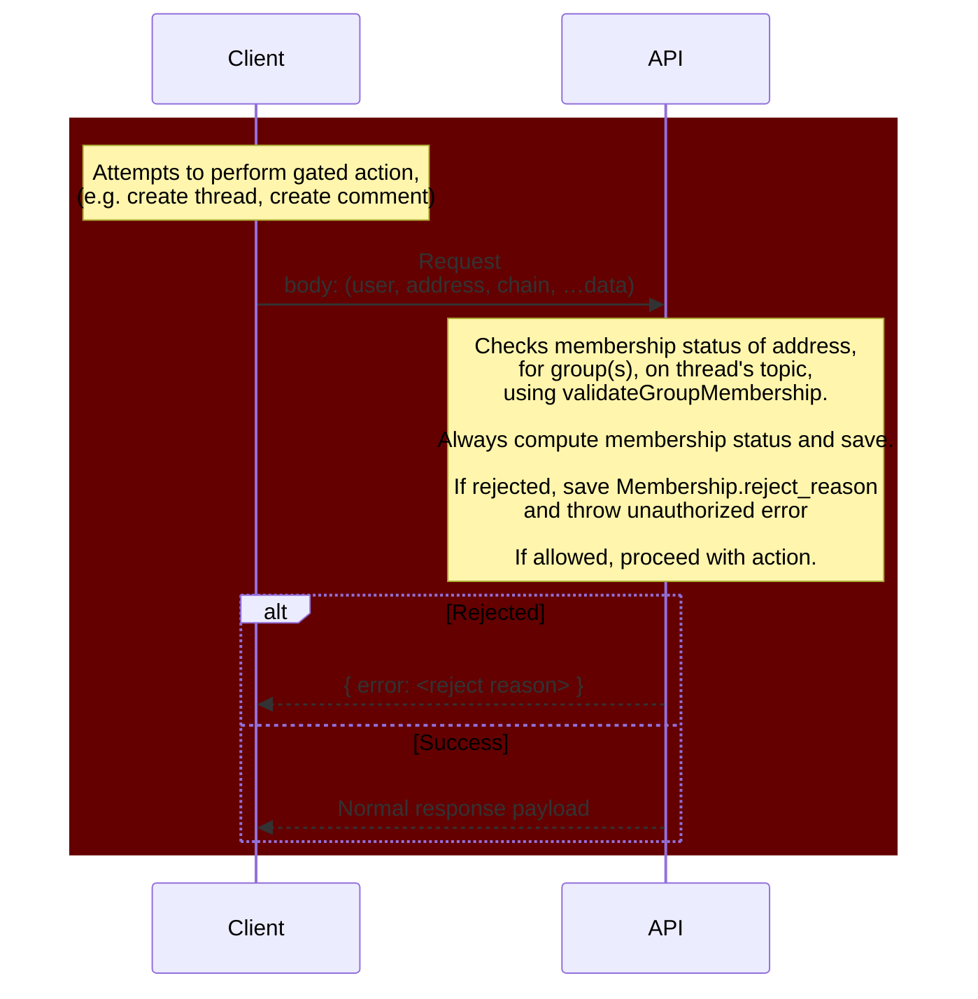

# Groups

## Contents

- [Introduction to Groups](#introduction-to-groups)
- [API Diagrams](#api-diagrams)
  + [Membership Check](#membership-check)
  + [User Performs Mutation Action](#user-performs-mutation-action)
  + [Create Group](#create-group)
  + [View Group Memberships](#view-group-memberships)
  + [Update/delete Group](#updatedelete-group)
- [Change Log](#change-log)

## Introduction to Groups

`Groups` are used by community admins to handle permissioning across the forum, using associated `Membership` objects that link `Addresses` to Groups.

Forum actions are always topic-scoped; whenever a user creates a new thread, reacts to a comment, or participates in a poll, they are operating within the scope of a topic. Groups allow admins to "gate" these user actions, within a given topic-scope, based on a set of Requirements.

Groups are defined by sets of `Requirements`. A Requirement is a rule or logical statement that qualifies a given address for Group membership. As of 231031, the two Requirements supported on our backend are token thresholds (i.e., that a given address has a certain token balance) and allowlists (i.e., whitelists manually constructed by a community admin).

From a database perspective, Groups consist of a metadata object, an associated Community (chain), an associated Membership, and an array of Requirements. Requirement objects consist of a `rule` string (e.g. "threshold") and a data object (e.g. `ThresholdData`). Requirement objects must conform to the latest JSON schema; as of 231109, that is [v1](../packages/commonwealth/server/util/requirementsModule/requirementsSchema_v1.js). Membership validation checks, and requirement types can be found in the `/server/util/requirementsModule` directory.

## API Diagrams

### Membership Check

## User Performs Mutation Action

## Create Group

```mermaid
sequenceDiagram

  rect rgb(0, 20, 0)

  Note over Client: Admin creates a Group

  Client->>API: POST /groups <br> body: (user, chain, address, metadata, requirements, topics)

  Note over API: Validate schema. <br><br> Check limit of 20 groups per chain. <br><br> Save group <br><br> Optionally add group to each specified topic.

  API-->>Client: Response payload (Group): <br><br> id: number <br> chain_id: string <br> metadata: MetadataJSON <br> requirements: RequirementsJSON

  end
```

## View Group Memberships

```mermaid
sequenceDiagram

  rect rgb(0, 0, 20)

  Note over Client: Admin views Group Memberships page

  Client ->> API: GET /groups?chain_id=XXX&members=true <br>(no auth)

  Note over API: Gets all allowed memberships, <br> for all groups, for all topics <br> in the community. <br><br> No compute, only DB query. <br><br> Rejected memberships are not returned (?).

  API -->> Client: Response payload (Group w/ members): <br><br> id: number <br> chain_id: string <br> metadata: MetadataJSON <br> requirements: RequirementsJSON <br> members?: { <br> group_id: number <br> address_id: number <br> allowed: true <br> last checked: Date<br>}[]

  end
```

## Update/delete Group

```mermaid
sequenceDiagram

  rect rgb(0, 0, 50)

  Note over Client: Admin updates/deletes Group

  Client ->> API: DELETE /groups/:id <br> body: (user, chain, address)

  Note over API: Deletes all Memberships of the group, <br> then updates/deletes the group.

  API -->> Client: OK

  end
```

## Change Log

- 231109: Updated by Graham Johnson with an introduction (#5517).
- 231023: Authored by Graham Johnson with initial API diagrams.
