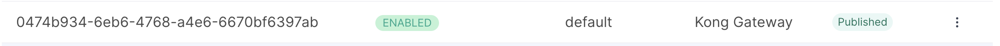
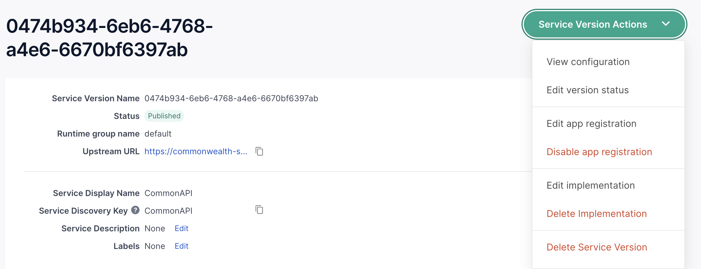

To switch which url kong is gating, go into the services hub:

Then go to this gateway:

You will see the upstream url:

Set the "host" field to the Heroku server URL we want kong to gate, e.g. `commonwealth-staging2.herokuapp.com`.

# Change Log

- 231012: Flagged by Graham Johnson: Could use more explicit clarity and context.
- 230205: Authored by Kurtis Assad.
