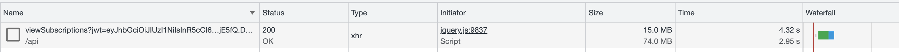

# Over-Fetching

This document pertains to situations where we retrieve more data than required. This is commonly observed when Sequelize queries behind endpoints extract excessive information.

## Contents

- [Examples in our Routes of Over-Fetching](#examples-in-our-routes-of-over-fetching)
- [Common Scenarios](#common-scenarios)
  * [Scenario 1: Accidentally pulling all attributes using Sequelize](#scenario-1-accidentally-pulling-all-attributes-using-sequelize)
  * [Scenario 2: Response format doesn't allow pagination](#scenario-2-response-format-doesnt-allow-pagination)
  * [Scenario 3: Grabbing unused data](#scenario-3-grabbing-unused-data)
  * [Change Log](#change-log)

## Examples in our Routes of Over-Fetching

- **User Profile** - Our primary need is the user's name and avatar URL. Despite this, we are also pulling in extra data like the user's biography and all corresponding addresses.
- **Comment Text** - We're primarily interested in the text content of the comments. However, we're presently extracting the full version history as well.
- **Threaded Discussions with Comments** - While our main goal is to extract only the threads, we're currently compiling all related comments along with their extensive version histories. A more efficient approach would be to limit the export to the 50 most recent comments.

## Common Scenarios

### Scenario 1: Accidentally pulling all attributes using Sequelize

- In some instances, we are **over-fetching data by over 99%**, resulting in unnecessary strain on the Database and Network. An example of this can be seen with `/viewSubscriptions`.

Here is [viewSubscription query](https://github.com/hicommonwealth/commonwealth/blob/0fca7428d17cb860a676eaf9c28825ad7d4416ed/packages/commonwealth/server/routes/subscription/viewSubscriptions.ts#L45)



SQL Query: **120 attributes fetched**

```sql
SELECT 
  "Subscription"."id", 
  "Subscription"."subscriber_id", 
  "Subscription"."category_id", 
  "Subscription"."object_id", 
  "Subscription"."is_active", 
  "Subscription"."immediate_email", 
  "Subscription"."chain_id", 
  "Subscription"."offchain_thread_id", 
  "Subscription"."offchain_comment_id", 
  "Subscription"."snapshot_id", 
  "Subscription"."created_at", 
  "Subscription"."updated_at", 
  "Thread"."id" AS "Thread.id", 
  "Thread"."address_id" AS "Thread.address_id", 
  "Thread"."created_by" AS "Thread.created_by", 
  "Thread"."title" AS "Thread.title", 
  "Thread"."body" AS "Thread.body", 
  "Thread"."plaintext" AS "Thread.plaintext", 
  "Thread"."kind" AS "Thread.kind", 
  "Thread"."stage" AS "Thread.stage", 
  "Thread"."url" AS "Thread.url", 
  "Thread"."topic_id" AS "Thread.topic_id", 
  "Thread"."pinned" AS "Thread.pinned", 
  "Thread"."chain" AS "Thread.chain", 
  "Thread"."view_count" AS "Thread.view_count", 
  "Thread"."read_only" AS "Thread.read_only", 
  "Thread"."version_history" AS "Thread.version_history", 
  "Thread"."links" AS "Thread.links", 
  "Thread"."has_poll" AS "Thread.has_poll", 
  "Thread"."canvas_action" AS "Thread.canvas_action", 
  "Thread"."canvas_session" AS "Thread.canvas_session", 
  "Thread"."canvas_hash" AS "Thread.canvas_hash", 
  "Thread"."created_at" AS "Thread.created_at", 
  "Thread"."updated_at" AS "Thread.updated_at", 
  "Thread"."last_edited" AS "Thread.last_edited", 
  "Thread"."deleted_at" AS "Thread.deleted_at", 
  "Thread"."last_commented_on" AS "Thread.last_commented_on", 
  "Thread"."marked_as_spam_at" AS "Thread.marked_as_spam_at", 
  "Thread"."locked_at" AS "Thread.locked_at", 
  "Thread->Address"."id" AS "Thread.Address.id", 
  "Thread->Address"."address" AS "Thread.Address.address", 
  "Thread->Address"."chain" AS "Thread.Address.chain", 
  "Thread->Address"."role" AS "Thread.Address.role", 
  "Thread->Address"."is_user_default" AS "Thread.Address.is_user_default", 
  "Thread->Address"."verified" AS "Thread.Address.verified", 
  "Thread->Address"."keytype" AS "Thread.Address.keytype", 
  "Thread->Address"."last_active" AS "Thread.Address.last_active", 
  "Thread->Address"."user_id" AS "Thread.Address.user_id", 
  "Thread->Address"."is_councillor" AS "Thread.Address.is_councillor", 
  "Thread->Address"."is_validator" AS "Thread.Address.is_validator", 
  "Thread->Address"."ghost_address" AS "Thread.Address.ghost_address", 
  "Thread->Address"."profile_id" AS "Thread.Address.profile_id", 
  "Thread->Address"."wallet_id" AS "Thread.Address.wallet_id", 
  "Thread->Address"."user_id" AS "Thread.Address.UserId", 
  "Comment"."id" AS "Comment.id", 
  "Comment"."community_id" AS "Comment.community_id", 
  "Comment"."thread_id" AS "Comment.thread_id", 
  "Comment"."parent_id" AS "Comment.parent_id", 
  "Comment"."address_id" AS "Comment.address_id", 
  "Comment"."created_by" AS "Comment.created_by", 
  "Comment"."text" AS "Comment.text", 
  "Comment"."plaintext" AS "Comment.plaintext", 
  "Comment"."version_history" AS "Comment.version_history", 
  "Comment"."canvas_action" AS "Comment.canvas_action", 
  "Comment"."canvas_session" AS "Comment.canvas_session", 
  "Comment"."canvas_hash" AS "Comment.canvas_hash", 
  "Comment"."created_at" AS "Comment.created_at", 
  "Comment"."updated_at" AS "Comment.updated_at", 
  "Comment"."deleted_at" AS "Comment.deleted_at", 
  "Comment"."marked_as_spam_at" AS "Comment.marked_as_spam_at", 
  "Comment->Address"."id" AS "Comment.Address.id", 
  "Comment->Address"."address" AS "Comment.Address.address", 
  "Comment->Address"."chain" AS "Comment.Address.chain", 
  "Comment->Address"."role" AS "Comment.Address.role", 
  "Comment->Address"."is_user_default" AS "Comment.Address.is_user_default", 
  "Comment->Address"."verified" AS "Comment.Address.verified", 
  "Comment->Address"."keytype" AS "Comment.Address.keytype", 
  "Comment->Address"."last_active" AS "Comment.Address.last_active", 
  "Comment->Address"."user_id" AS "Comment.Address.user_id", 
  "Comment->Address"."is_councillor" AS "Comment.Address.is_councillor", 
  "Comment->Address"."is_validator" AS "Comment.Address.is_validator", 
  "Comment->Address"."ghost_address" AS "Comment.Address.ghost_address", 
  "Comment->Address"."profile_id" AS "Comment.Address.profile_id", 
  "Comment->Address"."wallet_id" AS "Comment.Address.wallet_id", 
  "Comment->Address"."user_id" AS "Comment.Address.UserId", 
  "Chain"."id" AS "Chain.id", 
  "Chain"."chain_node_id" AS "Chain.chain_node_id", 
  "Chain"."name" AS "Chain.name", 
  "Chain"."discord_config_id" AS "Chain.discord_config_id", 
  "Chain"."description" AS "Chain.description", 
  "Chain"."token_name" AS "Chain.token_name", 
  "Chain"."website" AS "Chain.website", 
  "Chain"."discord" AS "Chain.discord", 
  "Chain"."element" AS "Chain.element", 
  "Chain"."telegram" AS "Chain.telegram", 
  "Chain"."github" AS "Chain.github", 
  "Chain"."default_symbol" AS "Chain.default_symbol", 
  "Chain"."network" AS "Chain.network", 
  "Chain"."base" AS "Chain.base", 
  "Chain"."ss58_prefix" AS "Chain.ss58_prefix", 
  "Chain"."icon_url" AS "Chain.icon_url", 
  "Chain"."active" AS "Chain.active", 
  "Chain"."stages_enabled" AS "Chain.stages_enabled", 
  "Chain"."custom_stages" AS "Chain.custom_stages", 
  "Chain"."custom_domain" AS "Chain.custom_domain", 
  "Chain"."block_explorer_ids" AS "Chain.block_explorer_ids", 
  "Chain"."collapsed_on_homepage" AS "Chain.collapsed_on_homepage", 
  "Chain"."type" AS "Chain.type", 
  "Chain"."substrate_spec" AS "Chain.substrate_spec", 
  "Chain"."has_chain_events_listener" AS "Chain.has_chain_events_listener", 
  "Chain"."default_summary_view" AS "Chain.default_summary_view", 
  "Chain"."default_page" AS "Chain.default_page", 
  "Chain"."has_homepage" AS "Chain.has_homepage", 
  "Chain"."hide_projects" AS "Chain.hide_projects", 
  "Chain"."terms" AS "Chain.terms", 
  "Chain"."bech32_prefix" AS "Chain.bech32_prefix", 
  "Chain"."admin_only_polling" AS "Chain.admin_only_polling", 
  "Chain"."category" AS "Chain.category", 
  "Chain"."created_at" AS "Chain.created_at", 
  "Chain"."updated_at" AS "Chain.updated_at" 
FROM 
  "Subscriptions" AS "Subscription" 
  LEFT OUTER JOIN "Threads" AS "Thread" ON "Subscription"."offchain_thread_id" = "Thread"."id" 
  AND ("Thread"."deleted_at" IS NULL) 
  LEFT OUTER JOIN "Addresses" AS "Thread->Address" ON "Thread"."address_id" = "Thread->Address"."id" 
  LEFT OUTER JOIN "Comments" AS "Comment" ON "Subscription"."offchain_comment_id" = "Comment"."id" 
  AND ("Comment"."deleted_at" IS NULL) 
  LEFT OUTER JOIN "Addresses" AS "Comment->Address" ON "Comment"."address_id" = "Comment->Address"."id" 
  LEFT OUTER JOIN "Chains" AS "Chain" ON "Subscription"."chain_id" = "Chain"."id" 
  AND "Chain"."active" = true 
WHERE 
  (
    "Subscription"."subscriber_id" = 6
  );
```

By excluding certain attributes, we managed to reduce data size by 15 times, shrinking from 15MB to 1MB as per the changes implemented in the pull request [3966](https://github.com/hicommonwealth/commonwealth/pull/3966).


### Scenario 2: Response format doesn't allow pagination

- In extreme instances, over-fetching can lead to **out of memory errors**. This problem can be observed in the `getThreads` endpoint when it includes comments:

Even when fetching paginated threads, the comments array for each thread is fetched without pagination. This approach can result in substantial memory usage for threads with many comments. The code snippet responsible for this behavior can be found in the [getThreads with include_comments](https://github.com/hicommonwealth/commonwealth/blob/0fca7428d17cb860a676eaf9c28825ad7d4416ed/packages/commonwealth/server/routes/threads/getThreads.ts#L77) function.

This endpoint fetches all **700+ threads for Osmosis, including all comments** associated with each thread:

```http
GET http://localhost:8080/external/threads?community_id=osmosis&include_comments=true
```

Response structure:

```json
{
  "threads": {
    "id",
    "comments": [...all comments with all attributes]
  }
}
```

This issue is addressed in the changes of pull request [3966](https://github.com/hicommonwealth/commonwealth/pull/3966).

### Scenario 3: Grabbing unused data

- **Unnecessary joining and fetching of attributes** in a fairly frequently used query that are not utilized in the frontend is a prevalent issue. This is seen in `viewUserActivity` and `viewGlobalActivity`. For instance, reactions and profile information are fetched even though they are not required.

Code Snippet is from [here](https://github.com/hicommonwealth/commonwealth/blob/0fca7428d17cb860a676eaf9c28825ad7d4416ed/packages/commonwealth/server/routes/viewUserActivity.ts#L50)

```sql
LEFT JOIN "Reactions" tr ON nt.thread_id = CAST(tr.thread_id AS VARCHAR)
LEFT JOIN "Reactions" cr ON oc.id = cr.comment_id
```

Code Snippet is from [here](https://github.com/hicommonwealth/commonwealth/blob/0fca7428d17cb860a676eaf9c28825ad7d4416ed/packages/commonwealth/server/routes/viewUserActivity.ts#L76)

```javascript
const profiles = await models.Profile.findAll({
where: {
  id: addresses.map((a) => a.profile_id),
},
include: [
  {
    model: models.Address,
  },
 ],
});
```

A new query for `viewUserActivity` and `viewGlobalActivity` has been proposed in [this pull request](https://github.com/hicommonwealth/commonwealth/pull/4200). This optimized query operates under 200ms, improving the speed and efficiency of the system.

Additionally, this update also addresses code duplication between `viewUserActivity` and `viewGlobalActivity`. The redundant code has been consolidated into a single 'activity' query. When this query is passed a user_id, it returns user-specific activity; otherwise, it delivers global activity. This change enhances the code's maintainability and readability while still retaining its functionality.

### Change Log

- 230629: Authored by Nakul Manchanda.
