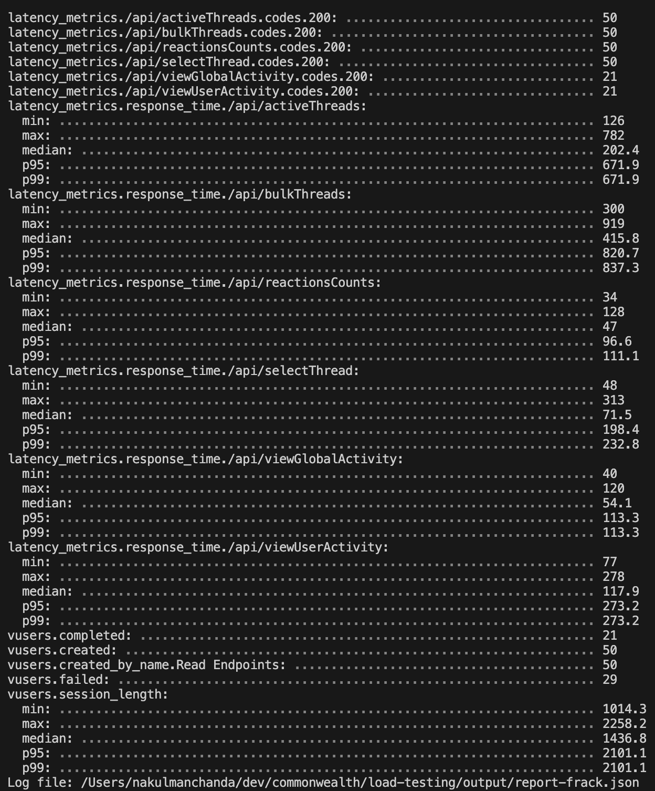

# Performance Benchmarks

## Contents

- [Core Web Performance Metrics](#core-web-performance-metrics)
- [Essential Performance Tools](#essential-performance-tools)
  * [Browser Network Tab: Chrome/Firefox/Safari](#browser-network-tab-chromefirefoxsafari)
    + [Geographic Performance Assessment: WebPageTest.org](#geographic-performance-assessment-webpagetestorg)
  * [Load Testing: Artillery](#load-testing-artillery)
    + [Geographic Performance Assessment - Upcoming](#geographic-performance-assessment---upcoming)
    + [Benchmark PR Improvements](#benchmark-pr-improvements)
  * [Datadog Dashboards](#datadog-dashboards)
    + [QPS - Queries Per Second Dashboard](#qps---queries-per-second-dashboard)
    + [Latency Dashboard](#latency-dashboard)
    + [Geographic Performance Assessment - Forthcoming](#geographic-performance-assessment---forthcoming)
- [Change Log](#change-log)

## Core Web Performance Metrics

The performance of a website is key to its effective functionality and ensuring an exceptional user experience. Three critical performance metrics that have a substantial impact include:

1. **Page Load Time:** This refers to the time taken for a web page to completely load. A swift page load time often correlates with an improved user experience and enhanced user engagement.

2. **Time to First Byte (TTFB):** This metric calculates the duration from the moment a user initiates an HTTP request to the time the client's browser receives the first byte of information. A shorter TTFB typically signifies an efficient server response and strong network connectivity.

3. **First Contentful Paint (FCP):** FCP is the time elapsed from navigation until the first piece of content (text, images, etc.) appears on the screen. Lower FCP times can attract user attention faster and sustain their engagement.

It's crucial to test these metrics from various geographical locations as website performance can vary significantly based on factors such as server location, network latency, and local internet speeds. Evaluating performance metrics from different global regions guarantees a comprehensive understanding of user experiences and aids in fine-tuning the website for optimal performance worldwide.

## Essential Performance Tools

### Browser Network Tab: Chrome/Firefox/Safari

This is an indispensable tool for performance analysis, offering functions like cache disabling, traffic throttling, waterfall graph visualization, request/response analysis, and WebSocket traffic inspection. It also allows for the export of HAR files for future analysis and comparison.

Refer to the [Chrome DevTools Network Reference Guide](https://developer.chrome.com/docs/devtools/network/reference/) for more information.

#### Geographic Performance Assessment: WebPageTest.org

This tool enables performance testing from multiple global locations, providing insights into performance discrepancies based on geography. Key features include HAR file exports, result history storage, result sharing, and CDN setup and caching verification across various edge servers.

Check out this [Example Test Run](https://www.webpagetest.org/result/230620_AiDc78_B3K/).


### Load Testing: Artillery

Load testing assesses system behavior under certain loads in terms of concurrent users or transactions. It assists in identifying an application's maximum operating capacity, bottlenecks, and elements contributing to performance degradation.

Artillery allows the creation of load tests, like simulating 5 new users every second for 10 seconds:

```yaml
phases:
    - name: "Warm up"
      duration: 10
      arrivalRate: 5
```

Artillery supports defining scenarios for both POST and GET endpoints and capturing responses for use in subsequent requests. It also accommodates various plugins for metrics export in different formats and direct event transmission to Datadog or local statsd servers.

For a practical example, see [this pull request](https://github.com/hicommonwealth/commonwealth/pull/4403). Instructions for running the load tests are as follows:

```bash
git checkout load-testing
yarn --cwd load-testing install
#set up env.sh by copying env.local.sh
yarn test-load
```

#### Geographic Performance Assessment - Upcoming

- We plan to set up Artillery to run using AWS Lambda function(s) in different regions such as ap-southeast-1, us-east-1, and eu-central-1.


- This functionality is in-built in Artillery. Refer to the [Artillery documentation](https://www.artillery.io/docs/load-testing-at-scale/aws-lambda) for more details.

Here's a sample call leveraging AWS Lambda to run the benchmark from Singapore:

```
artillery run -o output_dir/report.json --environment frick app/scenarios/commonwealth-api-threads.yml --platform aws:lambda --platform-opt region ap-southeast-1
```

#### Benchmark PR Improvements

- We encourage you to include load testing in your PR test workflow.
- The load testing tool can be run against improvements proposed in your PR. You can deploy the PR on Frick & Frack, and run load testing to measure average runtimes against your PR. This will help confirm the performance improvements provided by your PR.



### Datadog Dashboards

We've implemented two new performance dashboards to monitor and track improvements in latency and call volume over time.

- We are utilizing the `express.response_time` metric reported to Datadog by the backend app available [here](https://github.com/hicommonwealth/commonwealth/blob/7e5c72252078ee2cfc237f99c43a1ad67e97dcf7/packages/commonwealth/server/scripts/setupExpressStats.ts#L29), with tags such as statusCode, method, path, and project.
- These dashboards serve a key role in prioritizing improvements by highlighting high call volume and slow endpoints.
- They are instrumental in monitoring the effect of improvements over time, as shown by specific examples corresponding to PRs like `getAddressProfile` larger batches and performance enhancements in backend API calls such as `/viewUserActivity` and `/status`.
- Additionally, they can effectively detect abnormal spikes in latency and call volume through real-time metrics reported to Datadog.

#### QPS - Queries Per Second Dashboard

- This dashboard displays the QPS for common endpoints.
- Here's an example screenshot:


From the dashboard, we observe that the `getAddressProfile` query count has substantially dropped from thousands to hundreds after a recent change that increased the batch size. This change can be found in [PR #3391](https://github.com/hicommonwealth/commonwealth/pull/3391).

#### Latency Dashboard

- This dashboard presents the 95th percentile latency for the same endpoints as the QPS dashboard.
- Here's an example screenshot for your reference:


As seen, notable performance improvements have been achieved in `viewUserActivity` by a factor of 1/3rd as a result of this [PR #3974](https://github.com/hicommonwealth/commonwealth/pull/3974).

Similarly, a tenfold performance enhancement has been achieved in the `status` call due to these PRs: [#3916](https://github.com/hicommonwealth/commonwealth/pull/3916) & [#4060](https://github.com/hicommonwealth/commonwealth/pull/4060).

These improvements are discussed in detail [here](./Request-Handler-Optimization.md).

#### Geographic Performance Assessment - Forthcoming

- We aim to extend the location TAG using `req.headers['cf-ipcountry']` - added by Cloudflare to each request. It can be included in the list of tags for the `express.response_time` metric reported to Datadog by the backend app available [here](https://github.com/hicommonwealth/commonwealth/blob/7e5c72252078ee2cfc237f99c43a1ad67e97dcf7/packages/commonwealth/server/scripts/setupExpressStats.ts#L29).
- We plan to filter the entire dashboard using a Dashboard variable to view performance from just one geographic location.

## Change Log

- 230724: Authored by Nakul Manchanda.
