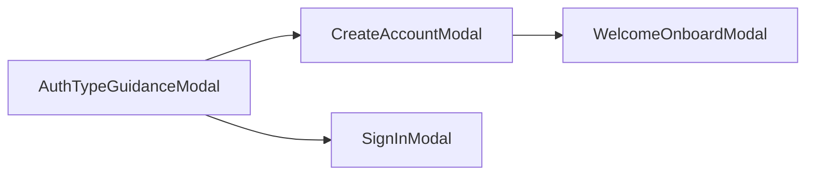
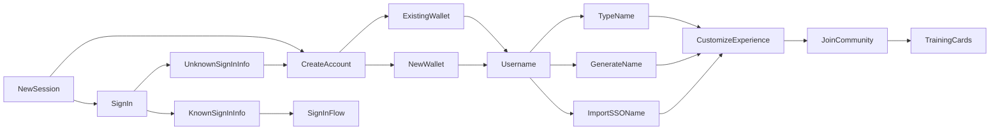

# Web Wallets

This entry documents our web wallet support and authentication flow. At some point, we may wish to split these topics into two separate entries.

## Contents

- [Wallet & SSO Support](#wallet--sso-support)
- [Sign-in & Onboarding Flow](#sign-in--onboarding-flow)
  + [Sign-in state](#sign-in-state)
  + [Flowchart](#flowchart)

## Wallet & SSO Support

1. The [WalletId enum](../libs/shared/src/types/protocol.ts) lists the wallet types we currently support.

    + `magic` is the wallet type used for SSO accounts (Google, Github, Discord, Twitter, etc)

    + the `walletconnect` type supports a plethora of Ethereum wallets not listed in the `WalletId` enum

2. The [WalletSsoSource enum](../libs/shared/src/types/protocol.ts) lists all the SSO types we currently support.

    + the `unknown` type here is used legacy support

3. SSO accounts are treated as an address in the app, similar to how we treat wallet addresses.

4. All authentication messages pass an `address` for user account; this address can be of any supported [ChainBase types](../libs/shared/src/types/protocol.ts).

    + An exception for this is SSO accounts which have either an Ethereum or Cosmos address.

    + If an SSO account is created from within a `cosmos` based community, then the final `address` of account will be a Cosmos address. In all other cases the `address` will be an Ethereum address.

5. The [ModalBase](../packages/commonwealth/client/scripts/views/modals/AuthModal/common/ModalBase/ModalBase.tsx) is the primary component responsible for contextually rendering wallets and handling authentication flow. It displays wallets conditionally dependent on the context of the page. The variable `showWalletsFor` determines which wallets are rendered.

    + Within non-community pages, 'Ethereum', 'Cosmos', 'Solana', and 'Substrate'-based wallets are rendered.

    + Within communities based on 'Ethereum', 'Cosmos', 'Solana', or 'Substrate' chains, wallets specific to the respective community chain are rendered.

    + Within the Near community, the Near wallet is rendered.

    + Within the 'terra' community, only the 'terrastation' and 'terra-walletconnect' wallets are rendered.

    + Within the 'evmos' and 'injective' communities, only 'cosm-metamask' and 'keplr-ethereum' wallets are rendered.

    + If the user doesn't have any of the wallets which are required for the context of the page, then the wallet list is rendered empty, with a `No wallets found` message. The SSO list is still displayed and user can use that to register an account and join a community.

## Sign-in & Onboarding Flow

As of 240601, a new User Onboarding flow has been introduced:

1. The user begins the authentication flow by clicking  the `Sign In` button in the header, or else by attempting to perform an auth-gated action.

2. Assuming a user selects the `Create account` button, the [CreateAccountModal](../packages/commonwealth/client/scripts/views/modals/AuthModal/CreateAccountModal/CreateAccountModal.tsx) is opened.

    1. The user is shown 2 options, `Create a wallet` and `I have a wallet`.

        + If `Create a wallet` is selected, only SSO options are rendered.

        + If `I have a wallet` is selected, only Web3 wallets are rendered.

    2. The user selects from the displayed wallet or SSO options.

        + If the user already has an account linked to the selected wallet or SSO option, then they will be signed into the app once the auth process is complete.

        + If the user does not have an account linked to the selected wallet or SSO option, the [WelcomeOnboardModal](../packages/commonwealth/client/scripts/views/modals/WelcomeOnboardModal/WelcomeOnboardModal.tsx) is opened once the authentication process completes.

3. Assuming a user clicked on the `Signup` button, the [SignInModal](../packages/commonwealth/client/scripts/views/modals/AuthModal/SignInModal/SignInModal.tsx) is opened.

    + The user can select from any available wallet or SSO option.

    + If the user already has an account linked to the selected wallet or SSO option, they are signed into the app once the authentication process completes.

4. If the user does not have an account linked to the selected wallet or SSO option, the [`AuthTypeGuidanceModal`](../packages/commonwealth/client/scripts/views/modals/AuthModal/AuthTypeGuidanceModal/AuthTypeGuidanceModal.tsx) is opened.

    + If `Create an account` is selected, the `CreateAccountModal` is displayed.

    + If `Sign in another way` is selected, the `SignInModal` is displayed.

### Sign-in state

A user's active account is stored in `app.user.activeAccount`, and updated in the [login controller](../packages/commonwealth/client/scripts/controllers/app/login.ts).

### Flowchart

## Change Log

- 240601: Authored by Graham Johnson and Malik Zulqurnain.
