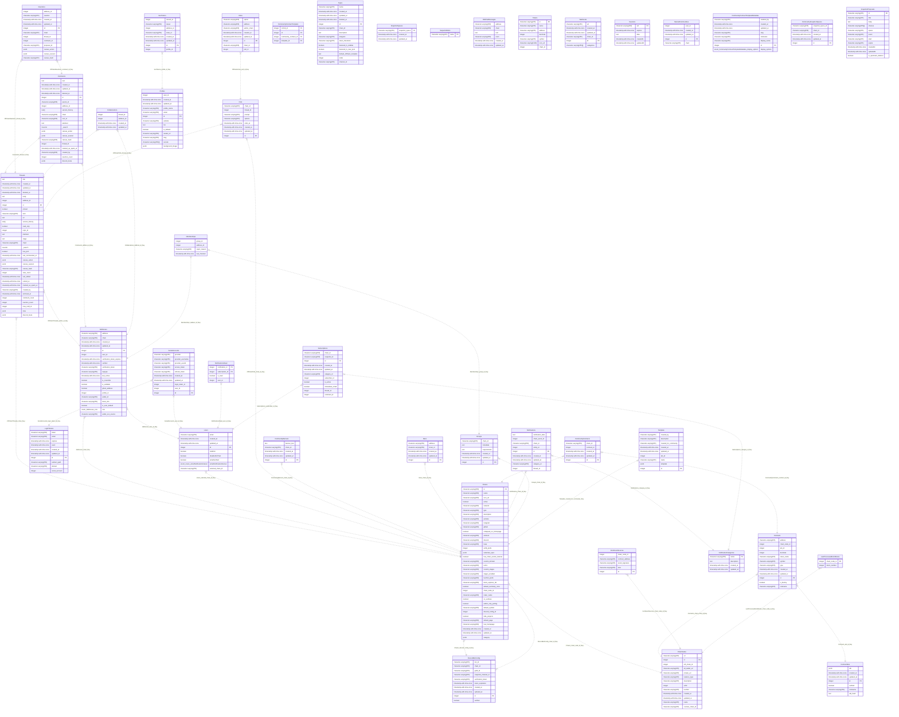

# Autogenerated Mermaid ERD

Last updated: Thu Oct 12 15:08:27 EDT 2023

```mermaid
erDiagram
  Threads }|..|| Addresses : OffchainThreads_author_id_fkey
  Threads }|..|| Chains : OffchainThreads_chain_fkey
  Comments }|..|| Addresses : Comments_address_id_fkey
  Comments }|..|| Threads : Comments_thread_id_fkey
  Chains }|..|| DiscordBotConfig : Chains_discord_config_id_fkey
  Chains }|..|| ChainNodes : Chains_chain_node_id_fkey
  Addresses }|..|| Users : Addresses_user_id_fkey
  Addresses }|..|| Chains : Addresses_chain_fkey
  SocialAccounts }|..|| Users : SocialAccounts_user_id_fkey
  SocialAccounts }|..|| LoginTokens : SocialAccounts_login_token_id_fkey
  Users }|..|| Chains : Users_selected_chain_id_fkey
  Reactions }|..|| Comments : OffchainReactions_comment_id_fkey
  Reactions }|..|| Threads : OffchainReactions_thread_id_fkey
  Collaborations }|..|| Addresses : Collaborations_address_id_fkey
  Collaborations }|..|| Threads : Collaborations_offchain_thread_id_fkey
  Votes }|..|| Polls : OffchainVotes_poll_id_fkey
  NotificationsRead }|..|| Users : NotificationsRead_user_id_fkey
  Polls }|..|| Threads : OffchainPolls_thread_id_fkey
  Polls }|..|| Chains : OffchainPolls_chain_id_fkey
  CommunityBanners }|..|| Chains : CommunityBanners_chain_id_fkey
  Bans }|..|| Chains : Bans_chain_id_fkey
  CommunityContracts }|..|| Contracts : CommunityContracts_contract_id_fkey
  CommunityContracts }|..|| Chains : CommunityContracts_chain_id_fkey
  SsoTokens }|..|| Profiles : SsoTokens_profile_id_fkey
  Contracts }|..|| ContractAbis : Contracts_abi_id_fkey
  Contracts }|..|| ChainNodes : Contracts_chain_node_id_fkey
  Notifications }|..|| Chains : Notifications_chain_id_fkey
  Notifications }|..|| NotificationCategories : Notifications_category_id_fkey
  DiscordBotConfig }|..|| Chains : DiscordBotConfig_chain_id_fkey
  Subscriptions }|..|| Users : Subscriptions_subscriber_id_fkey
  Subscriptions }|..|| NotificationCategories : Subscriptions_category_id_fkey
  Groups }|..|| Chains : Groups_chain_id_fkey
  Memberships }|..|| Addresses : Memberships_address_id_fkey
  Memberships }|..|| Groups : Memberships_group_id_fkey
  Template }|..|| Chains : Template_created_for_community_fkey
  EvmEventSources }|..|| ChainNodes : EvmEventSources_chain_node_id_fkey
  LastProcessedEvmBlocks }|..|| ChainNodes : LastProcessedEvmBlocks_chain_node_id_fkey
  CommunityContractTemplate {
    integer cctmd_id PK
    integer id PK
    integer community_contract_id PK
    integer template_id PK
  }
  Topics {
    character-varying(255) name 
    timestamp-with-time-zone created_at 
    timestamp-with-time-zone updated_at 
    timestamp-with-time-zone deleted_at 
    integer id PK
    character-varying(255) chain_id 
    text description 
    character-varying(255) telegram 
    character-varying(255) token_threshold 
    boolean featured_in_sidebar 
    boolean featured_in_new_post 
    text default_offchain_template 
    integer order 
    character-varying(255) channel_id 
  }
  LastProcessedEvmBlocks {
    integer chain_node_id PK
    integer block_number 
  }
  Bans {
    character-varying(255) address 
    character-varying(255) chain_id 
    timestamp-with-time-zone created_at 
    timestamp-with-time-zone updated_at 
    integer id PK
  }
  Comments {
    text text 
    timestamp-with-time-zone created_at 
    timestamp-with-time-zone updated_at 
    timestamp-with-time-zone deleted_at 
    integer id PK
    character-varying(255) parent_id 
    integer address_id 
    text[] version_history 
    character-varying(255) chain 
    character-varying(255) root_id 
    text plaintext 
    tsvector _search 
    jsonb canvas_action 
    jsonb canvas_session 
    character-varying(255) canvas_hash 
    integer thread_id 
    timestamp-with-time-zone marked_as_spam_at 
    character-varying(255) created_by 
    integer reaction_count 
    jsonb discord_meta 
  }
  SnapshotSpaces {
    character-varying(255) snapshot_space PK
    timestamp-with-time-zone created_at 
    timestamp-with-time-zone updated_at 
  }
  Contracts {
    character-varying(255) address 
    integer chain_node_id 
    integer abi_id 
    integer decimals 
    character-varying(255) token_name 
    character-varying(255) symbol 
    character-varying(255) type 
    timestamp-with-time-zone created_at 
    timestamp-with-time-zone updated_at 
    integer id PK
    boolean is_factory 
    character-varying(255) nickname 
  }
  DiscordBotConfig {
    character-varying(255) bot_id 
    character-varying(255) chain_id 
    character-varying(255) guild_id 
    character-varying(255) snapshot_channel_id 
    character-varying(255) verification_token 
    timestamp-with-time-zone token_expiration 
    timestamp-with-time-zone created_at 
    timestamp-with-time-zone updated_at 
    integer id PK
    boolean verified 
  }
  NotificationCategories {
    character-varying(255) name PK
    text description 
    timestamp-with-time-zone created_at 
    timestamp-with-time-zone updated_at 
  }
  SequelizeMeta {
    character-varying(255) name PK
  }
  Profiles {
    integer user_id 
    timestamp-with-time-zone created_at 
    timestamp-with-time-zone updated_at 
    character-varying(255) profile_name 
    character-varying(255) email 
    integer id PK
    character-varying(255) website 
    text bio 
    boolean is_default 
    character-varying(255) avatar_url 
    character-varying(255) slug 
    character-varying(255)[] socials 
    jsonb background_image 
  }
  Chains {
    character-varying(255) id PK
    character-varying(255) name 
    character-varying(255) icon_url 
    boolean active 
    character-varying(255) network 
    character-varying(255) type 
    character-varying(255) description 
    character-varying(255) website 
    character-varying(255) telegram 
    character-varying(255) github 
    boolean collapsed_on_homepage 
    character-varying(255) element 
    character-varying(255) discord 
    character-varying(255) base 
    integer ss58_prefix 
    jsonb substrate_spec 
    boolean has_chain_events_listener 
    character-varying(255) custom_domain 
    character-varying(255) terms 
    character-varying(255) custom_stages 
    character-varying(255) stages_enabled 
    character-varying(255) bech32_prefix 
    character-varying(255) block_explorer_ids 
    boolean default_summary_view 
    integer chain_node_id 
    character-varying(255) token_name 
    boolean ce_verbose 
    boolean admin_only_polling 
    character-varying(255) default_symbol 
    integer discord_config_id 
    boolean hide_projects 
    character-varying(255) default_page 
    character-varying(255) has_homepage 
    timestamp-with-time-zone created_at 
    timestamp-with-time-zone updated_at 
    jsonb category 
  }
  EvmEventSources {
    integer chain_node_id 
    character-varying(255) contract_address 
    character-varying(255) event_signature 
    character-varying(255) kind 
    integer id PK
  }
  Notifications {
    text notification_data 
    integer chain_event_id 
    character-varying(255) chain_id 
    integer entity_id 
    integer id PK
    timestamp-with-time-zone created_at 
    timestamp-with-time-zone updated_at 
    character-varying(255) category_id 
    integer thread_id 
  }
  SocialAccounts {
    character-varying(255) provider 
    character-varying(255) provider_username 
    character-varying(255) provider_userid 
    character-varying(255) access_token 
    character-varying(255) refresh_token 
    timestamp-with-time-zone created_at 
    timestamp-with-time-zone updated_at 
    integer login_token_id 
    integer user_id 
    integer id PK
  }
  NotificationsRead {
    integer notification_id PK
    integer subscription_id PK
    boolean is_read 
    integer user_id 
  }
  ContractAbis {
    jsonb abi 
    timestamp-with-time-zone created_at 
    timestamp-with-time-zone updated_at 
    integer id PK
    boolean verified 
    character-varying(255) nickname 
    text abi_hash 
  }
  OldChatMessages {
    character-varying(255) address 
    character-varying(255) chain 
    text text 
    character-varying(255) room 
    timestamp-with-time-zone created_at 
    timestamp-with-time-zone updated_at 
  }
  Votes {
    character-varying(255) option 
    character-varying(255) address 
    character-varying(255) author_chain 
    timestamp-with-time-zone created_at 
    timestamp-with-time-zone updated_at 
    integer id PK
    character-varying(255) chain_id 
    integer poll_id 
  }
  Tokens {
    character-varying(255) id PK
    character-varying(255) name 
    character-varying(255) address 
    integer decimals 
    character-varying(255) symbol 
    character-varying(1024) icon_url 
    integer chain_id 
  }
  Collaborations {
    integer thread_id 
    integer address_id 
    timestamp-with-time-zone created_at 
    timestamp-with-time-zone updated_at 
  }
  Memberships {
    integer group_id 
    integer address_id 
    character-varying(255) reject_reason 
    timestamp-with-time-zone last_checked 
  }
  ChainNodes {
    character-varying(255) url 
    integer id PK
    integer eth_chain_id 
    character-varying(255) alt_wallet_url 
    character-varying(255) private_url 
    character-varying(255) balance_type 
    character-varying(255) description 
    integer ss58 
    character-varying(255) bech32 
    timestamp-with-time-zone created_at 
    timestamp-with-time-zone updated_at 
    character-varying(255) name 
    character-varying(255) cosmos_chain_id 
  }
  Users {
    character-varying(255) email 
    timestamp-with-time-zone created_at 
    timestamp-with-time-zone updated_at 
    integer id PK
    boolean isAdmin 
    boolean disableRichText 
    boolean emailVerified 
    enum_Users_emailNotificationInterval emailNotificationInterval 
    character-varying(255) selected_chain_id 
  }
  Template {
    character-varying(255) created_by 
    character-varying(255) description 
    character-varying(255) created_for_community 
    timestamp-with-time-zone created_at 
    timestamp-with-time-zone updated_at 
    integer abi_id 
    character-varying(255) name 
    jsonb template 
    integer id PK
  }
  Webhooks {
    character-varying(255) url 
    timestamp-with-time-zone created_at 
    timestamp-with-time-zone updated_at 
    character-varying(255) chain_id 
    integer id PK
    character-varying(255)[] categories 
  }
  Reactions {
    integer address_id 
    character-varying(255) reaction 
    timestamp-with-time-zone created_at 
    timestamp-with-time-zone updated_at 
    integer id PK
    character-varying(255) chain 
    integer thread_id 
    integer comment_id 
    character-varying(255) proposal_id 
    jsonb canvas_action 
    jsonb canvas_session 
    character-varying(255) canvas_hash 
  }
  LoginTokens {
    character-varying(255) token 
    character-varying(255) email 
    timestamp-with-time-zone expires 
    timestamp-with-time-zone used 
    timestamp-with-time-zone created_at 
    timestamp-with-time-zone updated_at 
    integer id PK
    character-varying(255) redirect_path 
    character-varying(255) domain 
    integer social_account 
  }
  Sessions {
    character-varying(255) sid PK
    timestamp-with-time-zone expires 
    text data 
    timestamp-with-time-zone createdAt 
    timestamp-with-time-zone updatedAt 
  }
  StarredCommunities {
    integer user_id 
    timestamp-with-time-zone created_at 
    timestamp-with-time-zone updated_at 
    integer id PK
    character-varying(255) chain 
  }
  Subscriptions {
    character-varying(255) chain_id 
    character-varying(255) snapshot_id 
    integer id PK
    timestamp-with-time-zone created_at 
    timestamp-with-time-zone updated_at 
    character-varying(255) category_id 
    integer subscriber_id 
    boolean is_active 
    boolean immediate_email 
    integer thread_id 
    integer comment_id 
  }
  SsoTokens {
    integer issued_at 
    character-varying(255) issuer 
    integer address_id 
    character-varying(255) state_id 
    timestamp-with-time-zone created_at 
    timestamp-with-time-zone updated_at 
    integer id PK
    integer profile_id 
  }
  CommunityContractTemplateMetadata {
    character-varying(255) enabled_by 
    timestamp-with-time-zone created_at 
    timestamp-with-time-zone updated_at 
    character-varying(255) slug 
    character-varying(255) nickname 
    character-varying(255) display_name 
    integer id PK
    enum_CommunityContractTemplateMetadata_display_options display_options 
  }
  Polls {
    character-varying(255) chain_id 
    integer thread_id 
    character-varying(255) prompt 
    character-varying(255) options 
    timestamp-with-time-zone ends_at 
    timestamp-with-time-zone created_at 
    timestamp-with-time-zone updated_at 
    integer id PK
  }
  Groups {
    character-varying(255) chain_id 
    json metadata 
    json requirements 
    timestamp-with-time-zone created_at 
    timestamp-with-time-zone updated_at 
    integer id PK
  }
  CommunitySnapshotSpaces {
    character-varying(255) snapshot_space_id 
    character-varying(255) chain_id 
    timestamp-with-time-zone created_at 
    timestamp-with-time-zone updated_at 
    integer id PK
  }
  SnapshotProposals {
    character-varying(255) id PK
    character-varying(255) title 
    text body 
    character-varying(255)[] choices 
    character-varying(255) space 
    character-varying(255) event 
    character-varying(255) start 
    character-varying(255) expire 
    timestamp-with-time-zone createdAt 
    timestamp-with-time-zone updatedAt 
    boolean is_upstream_deleted 
  }
  CommunityBanners {
    text banner_text 
    character-varying(255) chain_id 
    timestamp-with-time-zone created_at 
    timestamp-with-time-zone updated_at 
    integer id PK
  }
  Addresses {
    character-varying(255) address 
    character-varying(255) chain 
    timestamp-with-time-zone created_at 
    timestamp-with-time-zone updated_at 
    integer id PK
    integer user_id 
    timestamp-with-time-zone verification_token_expires 
    timestamp-with-time-zone verified 
    character-varying(255) verification_token 
    character-varying(255) keytype 
    timestamp-with-time-zone last_active 
    boolean is_councillor 
    boolean is_validator 
    boolean ghost_address 
    integer profile_id 
    character-varying(255) wallet_id 
    character-varying(255) block_info 
    boolean is_user_default 
    enum_Addresses_role role 
    character-varying(255) wallet_sso_source 
  }
  CommunityContracts {
    character-varying(255) chain_id 
    integer contract_id 
    timestamp-with-time-zone created_at 
    timestamp-with-time-zone updated_at 
    integer id PK
  }
  Threads {
    text title 
    timestamp-with-time-zone created_at 
    timestamp-with-time-zone updated_at 
    timestamp-with-time-zone deleted_at 
    text body 
    integer address_id 
    integer id PK
    boolean pinned 
    character-varying(255) kind 
    text url 
    text[] version_history 
    boolean read_only 
    integer topic_id 
    text plaintext 
    text stage 
    character-varying(255) chain 
    tsvector _search 
    boolean has_poll 
    timestamp-with-time-zone last_commented_on 
    jsonb canvas_action 
    jsonb canvas_session 
    character-varying(255) canvas_hash 
    integer view_count 
    timestamp-with-time-zone last_edited 
    timestamp-with-time-zone locked_at 
    timestamp-with-time-zone marked_as_spam_at 
    character-varying(255) created_by 
    timestamp-with-time-zone archived_at 
    integer comment_count 
    integer reaction_count 
    integer max_notif_id 
    jsonb links 
    jsonb discord_meta 
  }
```
