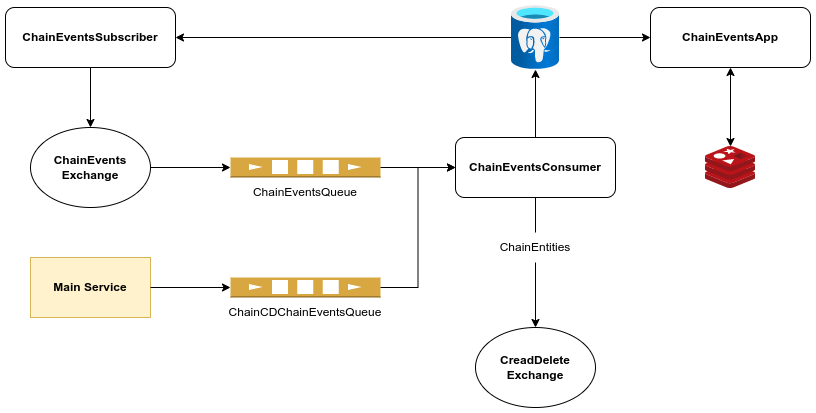

# Chains-events Microservice
## Design

## Explanation
### ChainEventsSubscriber
- This server subscribes to a subset of chains in order to capture chain-events which it subsequently
formats and enriches. Once the chain-event is properly formatted, it published to the ChainEvents Exchange
using the RabbitMQController.
### ChainEventsConsumer
- This server initializes an instance of the ServiceConsumer. The ServiceConsumer is passed
a single processor function for each queue that it will subscribe to. For an example see: 
[ChainEventsQueueProcessor](ChainEventsConsumer/MessageProcessors/ChainEventsQueue.ts).
- The processor functions are passed as RabbitMQSubscription see: [RabbitMQSubscription](../../common-common/src/ServiceConsumer.ts)
- The ChainEventsConsumer also publishes ChainEntities to the CreateDeleteExchange since minimal ChainEntity data is
required on the Main Service to create the ChainEntityMeta table.
### Queues
- ChainEventsQueue
  - Formatted and enriched chain-events to be processed by the ChainEventsConsumer
- ChainCDChainEventsQueue
  - New chains and chainNodes created on the master service that the ChainEventsConsumer saves in the ChainEvents service
  database.
